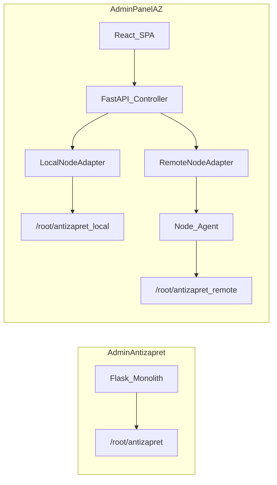

# Статус переноса из AdminAntizapret

> **Baseline:** [AdminAntizapret](https://github.com/Kirito0098/AdminAntizapret) **1.9.0** → AdminPanelAZ **1.0.0**
> **Обновлено:** 2026-06-08
> **Источник для сравнения:** `/opt/AdminAntizapret` (Flask + Jinja2) · **Цель:** `/opt/AdminPanelAZ` (FastAPI + React)

AdminPanelAZ — порт веб-панели AdminAntizapret на FastAPI + React. Релиз **1.0.0** закрывает фазы 0–20 плана переноса: основная функциональность AA 1.9.0 перенесена или покрыта эквивалентами; оставшиеся пробелы — в секции backlog и чеклисте production readiness в [`README.md`](README.md).

---

## Легенда

| Маркер | Значение |
|--------|----------|
| ✅ | **Перенесено** — функциональность есть, API и UI работают |
| 🟡 | **Частично** — упрощённый порт, подмножество возможностей или без UI |
| ❌ | **Не перенесено** — отсутствует в AdminPanelAZ |
| 🆕 | **Новое** — есть только в AdminPanelAZ (не было в AdminAntizapret) |

---

## Как обновлять этот документ

1. При переносе модуля из AdminAntizapret — перенести строку из ❌/🟡 в ✅ и обновить «Карту соответствия».
2. При упрощённом порте — оставить 🟡 с пояснением, чего не хватает.
3. Обновить поле **Обновлено** и при релизе — baseline-версию AdminPanelAZ.
4. Новую функциональность, которой не было в AA, добавлять в секцию «🆕 Новое».

---

## Сводная таблица

| Область | Статус | Комментарий |
|---------|--------|-------------|
| VPN-клиенты (OpenVPN, WireGuard, AmneziaWG) | ✅ | CRUD через `client.sh`, sync, download, QR |
| Политики доступа (блок, срок, лимиты) | ✅ | OpenVPN + WG/AWG |
| Синхронизация и графики трафика | ✅ | Фоновый collector + страница «Мониторинг трафика» |
| Лимиты трафика (reconcile) | ✅ | Reconcile + TG notify при превышении |
| Маршрутизация / CIDR | ✅ | Pipeline, провайдеры, games, AntiZapret config, presets CRUD |
| Редактор файлов AntiZapret | ✅ | Мультифайловый редактор + apply |
| Мониторинг сервера (CPU/RAM/vnstat/WS) | ✅ | Страница «Сервер» |
| NOC / подключённые клиенты / логи | ✅ | Monitoring + Logs |
| Безопасность (IP whitelist, scanner, rate limit, headers) | ✅ | `security.py`, global API rate limit, robots/security.txt (фаза 18) |
| QR / одноразовые ссылки | ✅ | Настройки в SecurityTab (не отдельная вкладка) |
| Бэкапы (ручные + авто + TG) | ✅ | + опция `client.sh 8` в BackupTab (ручной и авто) |
| Feature toggles | ✅ | 23 toggles (parity AA + `NIGHTLY_IDLE_RESTART` в AZ) |
| Telegram Login + Mini App | ✅ | |
| Telegram admin-уведомления | ✅ | Login, config ops, settings, CPU/RAM, traffic limits, ban/unban клиента, user create/delete, TG unlink |
| Auth (login, captcha, роли) | ✅ | + 🆕 2FA/TOTP, refresh tokens |
| Viewer role | ✅ | API, ограничения и UI назначения доступа в UsersTab |
| Журнал действий | ✅ | Просмотр и экспорт CSV |
| Обновление системы (git) | ✅ | Панель + 🆕 node agent / AntiZapret на узлах |
| In-panel pytest | ✅ | 48 модулей / 385 тестов (AA: 53; ~5 Jinja/Flask-only не портируются) |
| Установка / ops | ✅ | `install.sh` + `scripts/adminpanel-menu.sh`; diagnostics/safe-browsing CLI ✅ |
| Multi-node | 🆕 | Controller + Node Agent |
| CI/CD | ✅ | pytest + ruff + shellcheck + frontend build + eslint; pip-audit/bandit advisory |

---

## Архитектура

---

## Детально по разделам

### 1. VPN-клиенты

| Функция | AA 1.9.0 | AZ 1.0.0 | Статус |
|---------|----------|----------|--------|
| Создание / удаление OpenVPN | `ScriptExecutor` → `client.sh` | `antizapret.py` + `node_adapter.py` | ✅ |
| Создание / удаление WireGuard | то же | то же | ✅ |
| AmneziaWG (профили, вкладка) | index + config routes | `DashboardPage`, `ConfigCardsSection` | ✅ |
| Синхронизация списка с диском | index routes | `POST /api/configs/sync` | ✅ |
| Скачивание профилей | config routes | configs router | ✅ |
| QR-коды | `QRGenerator` | configs + qr endpoints | ✅ |
| Одноразовые ссылки | `QrDownloadService` | `qr_download.py`, `public_download.py` | ✅ |
| Продление сертификата OpenVPN | client actions | `ClientActionsDialog` | ✅ |
| Переключение OpenVPN UDP/TCP группы | `/set_openvpn_group` | `PUT /api/configs/openvpn-group`, `ConfigCardsSection` | ✅ |
| Публичные route-файлы (Keenetic, MikroTik, TP-Link) | `/public_download/<router>` | `GET /api/public/route-download/{router}` | ✅ |
| Toggle public download | `/toggle_public_download` | `POST /api/security/public-download`, `SecurityTab` | ✅ |
| `client.sh` в репозитории | ships `client.sh` | использует AntiZapret на сервере | — |

### 2. Политики доступа

| Функция | AA | AZ | Статус |
|---------|----|----|--------|
| Временная / постоянная блокировка OpenVPN | `OpenVpnAccessPolicyService` | `access_policy.py` | ✅ |
| Блокировка WG/AWG + runtime | `WgAccessPolicyService`, `wg_awg_runtime_apply.py` | `access_policy.py`, `wg_runtime.py`, `wg_policy_sync_worker.py` | ✅ |
| Срок действия WG | WG policy | `client_access.py` | ✅ |
| Лимиты трафика (1/7/30 дней) | `traffic_limit.py` | `traffic_limit.py` | ✅ |
| Reconcile после sync | `traffic_limit_reconcile.py` | `traffic_limit_reconcile.py` | ✅ |
| TG-уведомление при превышении лимита | `traffic_limit_notify.py` | `traffic_limit_notify.py` | ✅ |
| OpenVPN banlist (`banned_clients`) | `OpenVPNBanlistService` | `openvpn_management.py` | ✅ |

### 3. Трафик и мониторинг

| Функция | AA | AZ | Статус |
|---------|----|----|--------|
| Сбор статистики в SQLite | `utils/traffic_sync.py` | `traffic/collector.py` | ✅ |
| Графики per-client | traffic chart | `traffic/chart.py`, `TrafficPage.tsx` | ✅ |
| Подключённые клиенты (live) | `logs_dashboard/` | `MonitoringPage.tsx` | ✅ |
| OpenVPN events / sockets | logs routes | `LogsPage.tsx`, `logs.py` | ✅ |
| Сброс / очистка трафика | logs dashboard POST | `traffic.py` | ✅ |
| CPU/RAM + vnstat + WebSocket | `server_monitor/` | `server_monitor.py`, `ServerMonitorPage.tsx` | ✅ |
| TG-алерты CPU/RAM | AdminNotify | `admin_notify.py` + metrics workers | ✅ |
| NOC: метрики узла + панели | — | `MonitoringPage.tsx`, resource samples | 🆕 |
| История CPU/RAM (node + panel) | — | `node_resource_sample`, `panel_resource_sample` | 🆕 |

### 4. Маршрутизация и CIDR

| Функция | AA | AZ | Статус |
|---------|----|----|--------|
| Обзор маршрутизации | `/routing` | `RoutingPage.tsx` | ✅ |
| Провайдеры CIDR | cidr routes | `ProvidersTab`, `cidr/ip_manager.py` | ✅ |
| CIDR DB pipeline (refresh/generate) | cidr_db APIs | `cidr_db.py`, `CidrPipelineTab` | ✅ |
| Antifilter.net sync | antifilter API | `cidr_db.py` | ✅ |
| Пресеты CIDR | presets API (CRUD) | `PresetsTab` | ✅ |
| Game filters | полный `GAME_FILTER_CATALOG` | `game_catalog.py` (~75 игр, AA 1.9.0) | ✅ |
| Route-файлы (include/exclude IPs) | routing files | `FilesTab` | ✅ |
| run-doall / apply | `/run-doall` | `POST /api/routing/apply` | ✅ |
| Вкладка «Конфиг AntiZapret» | `get/update_antizapret_settings`, schema | `AntizapretConfigTab`, `GET/PUT /api/routing/antizapret-settings` | ✅ |
| Nightly CIDR DB refresh cron | cron + updater | `cidr_scheduler.py` (worker) | ✅ |

### 5. Редактор файлов

| Функция | AA | AZ | Статус |
|---------|----|----|--------|
| Domains (include/exclude/remove hosts) | `edit_files/` | `EditFilesPage.tsx`, `file_editor.py` | ✅ |
| IP/routing files | то же | то же | ✅ |
| Adblock hosts | то же | то же | ✅ |
| Security allow/deny IPs | то же | то же | ✅ |
| Apply + doall | POST handlers | `edit_files.py` | ✅ |
| Diff-подсветка | JS diff module | `EditFilesPage.tsx`, `buildLightDiff.ts` | ✅ |

### 6. Безопасность и доступ

| Функция | AA | AZ | Статус |
|---------|----|----|--------|
| Роли admin / viewer | `auth_manager.py` | `UserRole`, JWT | ✅ (+ 🆕 role `user`) |
| Captcha на login | captcha routes | `auth.py` | ✅ |
| IP allow-list (permanent) | `ip_restriction.py` | `security.py` | ✅ |
| Временный whitelist (1h/12h/24h) | temporary whitelist store | `security.py` + API + SecurityTab | ✅ |
| Scanner auto-block (ipset/iptables) | scanner store | `scanner_firewall_store.py` | ✅ |
| CSRF / CSP / security headers | `http_security.py` | middleware + robots/security.txt | ✅ |
| Rate limit login | Flask-Limiter (+ Redis) | auth rate limit (+ Redis для workers) | ✅ |
| Глобальный rate limit API | per-route only (нет default_limits) | middleware `/api/*` (+ Redis) | ✅ 🆕 |
| 2FA / TOTP | — | `TwoFactorTab`, TOTP columns | 🆕 |
| IP blocked dwell page | `ip_blocked/` | `ip_blocked.py` | ✅ |
| Session heartbeat | `/api/session-heartbeat` | `session.py` + `useSessionHeartbeat` | ✅ |
| Active session tracking | `ActiveWebSessionService` | `active_web_session.py` | ✅ |
| Nightly idle restart | `nightly_idle_restart.py` | `nightly_idle_restart_worker.py` | ✅ |

### 7. Бэкапы и обслуживание

| Функция | AA | AZ | Статус |
|---------|----|----|--------|
| Ручной бэкап (DB + .env + data) | `BackupManagerService` | `backups.py` | ✅ |
| Авто-бэкап по расписанию | `app_auto_backup.py` | `backup_scheduler.py` | ✅ |
| Restore / retention / delete | backup API | `backups.py` | ✅ |
| TG-доставка архивов | `backup_telegram_job.py` | `backup_scheduler.py`, `backups.py` | ✅ |
| Бэкап AntiZapret (`client.sh 8`) | `AntizapretBackupService` | `antizapret_backup.py` + `node_adapter` + BackupTab | ✅ |
| run-doall | maintenance | `maintenance.py` | ✅ |
| recreate profiles (`client.sh 7`) | settings | `settings.py` | ✅ |
| Restart service | admin routes | `maintenance.py` | ✅ |
| Runtime backup cleanup cron | cron job | `backup_scheduler.py` worker + toggle | ✅ |

### 8. Telegram

| Функция | AA | AZ | Статус |
|---------|----|----|--------|
| Telegram Login Widget | auth routes | `auth.py` | ✅ |
| Telegram Mini App | `tg_mini/` | `tg_mini.py`, static assets | ✅ |
| Отправка конфига в TG (Mini App) | tg_mini API | `tg_mini.py` | ✅ |
| AdminNotify (login, client ops, settings) | `admin_notify.py` | `admin_notify.py` | 🟡 |
| CPU/RAM alerts в TG | AdminNotify | `admin_notify.py` + metrics workers | ✅ |
| Traffic limit alerts в TG | `traffic_limit_notify.py` | `traffic_limit_notify.py` | ✅ |
| Тест TG-сообщения | settings API | `maintenance.py` | ✅ |
| `Telegram.md` (документация) | отдельный файл | `docs/Telegram.md` (Login, Mini App, AdminNotify, backups) | ✅ |

### 9. Настройки и администрирование

| Функция | AA | AZ | Статус |
|---------|----|----|--------|
| Управление пользователями | settings users tab | `UsersTab.tsx` | ✅ |
| Viewer config access UI | users tab | `UsersTab.tsx` + `/api/system/viewer-access` | ✅ |
| Feature toggles UI | settings tab | `FeatureTogglesTab.tsx` | ✅ |
| QR-настройки (TTL, PIN, max downloads) | отдельная вкладка | `SecurityTab.tsx` | ✅ |
| VPN-сеть (порт, HTTPS, Nginx из UI) | `_tab_vpn_network.html` | `VpnNetworkTab.tsx` + guided wizard (`POST /api/settings/vpn-network/publish` → `nginx-setup.sh`); custom certs — ops-only | ✅ |
| Журнал действий (просмотр) | action logs | `LogsPage.tsx` | ✅ |
| Экспорт action logs CSV | `/api/settings/action-logs/export` | `GET /api/logs/action-logs/export` | ✅ |
| Обновление панели (git) | `/update_system` | `UpdatesTab.tsx`, `system.py` | ✅ |
| In-panel pytest | `api_tests.py` | `TestsTab.tsx`, `tests.py`, `backend/tests/` (48 модулей) | ✅ |
| Обновление node agent + AntiZapret | — | `NodeUpdateDialog`, `nodes.py` | 🆕 |

### 10. Feature toggles (сравнение)

| Toggle (AA 1.9.0) | В AZ | Статус |
|-------------------|------|--------|
| `TRAFFIC_SYNC_ENABLED` | `traffic_sync` | ✅ |
| `MONITOR_ENABLED` | `resource_monitor` | ✅ |
| `FEATURE_OPENVPN_ENABLED` | `openvpn` | ✅ |
| `FEATURE_WIREGUARD_ENABLED` | `wireguard` | ✅ |
| `FEATURE_AMNEZIAWG_ENABLED` | `amneziawg` | ✅ |
| `FEATURE_LOGS_DASHBOARD_ENABLED` | `logs_dashboard` | ✅ |
| `FEATURE_SERVER_MONITOR_ENABLED` | `server_monitor` | ✅ |
| `FEATURE_ROUTING_ENABLED` | `routing` | ✅ |
| `FEATURE_EDIT_FILES_ENABLED` | `edit_files` | ✅ |
| `FEATURE_TELEGRAM_ENABLED` | `telegram` | ✅ |
| `FEATURE_BACKUPS_ENABLED` | `backups` | ✅ |
| `FEATURE_USER_MANAGEMENT_ENABLED` | `user_management` | ✅ |
| `FEATURE_SECURITY_ENABLED` | `security` | ✅ |
| `FEATURE_ACTION_LOGS_ENABLED` | `action_logs` | ✅ |
| `FEATURE_SYSTEM_UPDATES_ENABLED` | `system_updates` | ✅ |
| `FEATURE_DIAGNOSTICS_TESTS_ENABLED` | `diagnostics_tests` | ✅ |
| `FEATURE_QR_DOWNLOADS_ENABLED` | `qr_downloads` | ✅ |
| `FEATURE_VPN_NETWORK_ENABLED` | `vpn_network` | ✅ |
| `WG_POLICY_SYNC` (background) | cron `wg_awg_policy_sync.py` | `wg_policy_sync_worker.py` (async loop) | ✅ |
| `ACTIVE_SESSION_TRACKING` (background) | `active_web_session.py` | `active_web_session.py` + toggle | ✅ |
| `NIGHTLY_IDLE_RESTART` (background) | `nightly_idle_restart.py` (без env-toggle) | `nightly_idle_restart_worker.py` + toggle | 🆕 |
| `RUNTIME_BACKUP_CLEANUP` (background) | cron | `backup_scheduler.py` worker | ✅ |
| `FEATURE_MAINTENANCE_ENABLED` | maintenance tab | `MaintenanceTab` + guard `/api/maintenance/*`, maintenance settings API | ✅ |

> **Feature toggles (1.1.2):** parity AA для app_module ✅; в AZ добавлен toggle `NIGHTLY_IDLE_RESTART` (в AA — без отдельного env).

### 11. Установка и ops

| Компонент | AA | AZ | Статус |
|-----------|----|----|--------|
| One-liner install | `install.sh` | `install.sh` (+ pipe guard) | ✅ |
| Интерактивный мастер | `adminpanel.sh --install` | `install.sh` wizard | ✅ |
| Консольное меню (`adminpanel.sh`) | restart/update/backup/tests | `scripts/adminpanel-menu.sh` → `start.sh`, systemd, `backup-cli.py` | ✅ |
| SSL / Nginx setup | `ssl_setup.sh` | `scripts/nginx-setup.sh` | ✅ |
| Firewall panel port (runtime whitelist) | `panel_port_firewall.py` | `panel_port_firewall.py` + Security tab toggle; `firewall-setup.sh` — install-time only | ✅ |
| Uninstall / reinstall | `uninstall.sh` | `scripts/uninstall.sh` + menu | ✅ |
| Site diagnostics CLI | `site_diagnostics.sh` | `scripts/site-diagnostics.sh` + CLI | ✅ |
| Safe Browsing status CLI | `safe_browsing_status_cli.py` | `scripts/safe-browsing-status.py` | ✅ |
| env defaults | `env_defaults.sh` | `scripts/env_defaults.sh` (sync AA 1.9.0) | ✅ |
| CI (pytest, ruff, shellcheck, eslint) | `.github/workflows/ci.yml` | `.github/workflows/ci.yml` | ✅ |
| pre-commit hooks | `.pre-commit-config.yaml` | `.pre-commit-config.yaml` (ruff, shellcheck, eslint/bandit advisory) | ✅ |

### 12. UI / UX

| Аспект | AA | AZ | Статус |
|--------|----|----|--------|
| Рендеринг | Jinja2 + vanilla JS | React SPA (Vite, Tailwind, shadcn/ui) | 🆕 |
| Тёмная тема | CSS | Tailwind dark | ✅ |
| Mobile / Telegram Mini App | tg_mini templates | static tg_mini | ✅ |
| Прогресс фоновых задач (doall/update) | BackgroundTaskService | BackgroundTaskService + GET /api/tasks/{id} | ✅ |
| Multi-node selector | — | `NodeSelector`, `NodesPage` | 🆕 |

---

## 🆕 Новое в AdminPanelAZ

Функциональность, которой **не было** в AdminAntizapret 1.9.0:

- **Multi-node architecture** — Controller + Node Agent ([`backend/app/routers/nodes.py`](backend/app/routers/nodes.py), [`backend/node_agent/main.py`](backend/node_agent/main.py))
- **NOC-мониторинг** — вкладки VPN-узел / панель ([`frontend/src/pages/MonitoringPage.tsx`](frontend/src/pages/MonitoringPage.tsx))
- **2FA/TOTP** и refresh tokens ([`backend/app/routers/auth.py`](backend/app/routers/auth.py), [`frontend/src/components/settings/TwoFactorTab.tsx`](frontend/src/components/settings/TwoFactorTab.tsx))
- **Обновление node agent и AntiZapret** с панели ([`frontend/src/components/NodeUpdateDialog.tsx`](frontend/src/components/NodeUpdateDialog.tsx))
- **Resource metrics history** — CPU/RAM samples для узлов и controller
- **mTLS** panel ↔ agent ([`scripts/generate-mtls-certs.sh`](scripts/generate-mtls-certs.sh))
- **DDNS timer** (DuckDNS / No-IP)
- **Per-node scoping** в БД — `vpn_configs`, access policies привязаны к `node_id` ([`backend/app/database.py`](backend/app/database.py))
- **React SPA** вместо server-rendered Jinja2
- **Роль `user`** (между admin и viewer) в модели пользователей

---

## Карта соответствия файлов (AA → AZ)

| AdminAntizapret | AdminPanelAZ | Примечание |
|-----------------|--------------|------------|
| `core/services/access_policy.py` (OVPN/WG) | `backend/app/services/access_policy.py` | ported 1.9.0 |
| `core/services/traffic_limit.py` | `backend/app/services/traffic_limit.py` | ported 1.9.0 |
| `utils/traffic_limit_reconcile.py` | `backend/app/services/traffic_limit_reconcile.py` | ported 1.9.0 |
| `utils/traffic_sync.py` | `backend/app/services/traffic/collector.py` | ported |
| `core/services/file_editor.py` | `backend/app/services/file_editor.py` | ported |
| `core/services/env_file.py` | `backend/app/services/env_file.py` | ported |
| `core/services/feature_toggles.py` | `backend/app/services/feature_toggles.py` | ported 1.9.0 |
| `core/services/feature_guards.py` | `backend/app/services/feature_guards.py` | parity 1.9.0 |
| `core/services/ip_restriction.py` | `backend/app/services/ip_restriction.py` | ported |
| `core/services/scanner_firewall_store.py` | `backend/app/services/scanner_firewall_store.py` | ported |
| `core/services/security.py` | `backend/app/services/security.py` | simplified |
| `core/services/server_monitor.py` | `backend/app/services/server_monitor.py` | ported |
| `core/services/openvpn_management.py` | `backend/app/services/openvpn_management.py` | ported |
| `core/services/wg_awg_runtime_enforcer.py` | `backend/app/services/wg_runtime.py` | ported (syncconf fallback) |
| `core/services/qr_download*.py` | `backend/app/services/qr_download.py` | ported |
| `utils/app_auto_backup.py` | `backend/app/services/backup_scheduler.py` | ported |
| `core/services/background_tasks.py` | `backend/app/services/background_tasks.py` | ported (phase 14) |
| `core/services/cidr/*` | `backend/app/services/cidr/*` | ported |
| `ips/ip_manager.py` | `backend/app/services/cidr/ip_manager.py` | ported |
| `core/services/game_catalog.py` | `backend/app/services/cidr/game_catalog.py` | full catalog (AA 1.9.0) |
| `tg_mini/` | `backend/app/routers/tg_mini.py` + static | ported |
| `routes/settings/api_tests.py` | `backend/app/routers/tests.py` | ported |
| `ip_blocked/` | `backend/app/routers/ip_blocked.py` | ported |
| `script_sh/env_defaults.sh` | `scripts/env_defaults.sh` | synced 1.9.0 |
| `script_sh/ssl_setup.sh` | `scripts/nginx-setup.sh`, `nginx-common.sh` | patterned |
| `app.py` (Flask monolith) | `backend/app/main.py` + routers | restructured |
| `templates/` + `static/` | `frontend/src/` | full rewrite React |
| `core/services/admin_notify.py` | `backend/app/services/admin_notify.py` | ported; TG-хуки client_ban / user ops — pending |
| `routes/settings/antizapret.py` | `routing.py` + `AntizapretConfigTab` | ported (фаза 5) |
| `utils/nightly_idle_restart.py` | `nightly_idle_restart_worker.py` | ported (async worker) |
| `utils/wg_awg_runtime_apply.py` | `wg_runtime.py` + `wg_policy_sync_worker.py` | inline, no standalone CLI |
| `script_sh/adminpanel.sh` | `install.sh`, `scripts/adminpanel-menu.sh`, `start.sh`, systemd | install wizard + ops menu split |
| `script_sh/site_diagnostics.sh` | `scripts/site-diagnostics.sh` | AZ paths (backend/.env, uvicorn) |
| `script_sh/safe_browsing_status_cli.py` | `scripts/safe-browsing-status.py` | AZ User-Agent |
| `core/services/antizapret_backup.py` | `backend/app/services/antizapret_backup.py` | via node_adapter |
| `Telegram.md` | `docs/Telegram.md` | + AdminNotify, backups |

---

## Backlog переноса (приоритеты)

### Высокий приоритет

1. ~~**AdminNotify hooks**~~ ✅ — `send_client_ban`, `send_user_create` / `send_user_delete`, `send_tg_login_unlinked`
2. **Временный IP whitelist UI** — radio 1h/12h/24h в SecurityTab (API уже есть)
3. ~~**CIDR presets CRUD**~~ ✅ — `GET/POST/PUT/DELETE/reset` в `cidr_db.py`, `PresetsTab`

### Средний приоритет

4. ~~**Diff-подсветка**~~ ✅ — `buildLightDiff.ts`, `DiffPanel`, live diff + «Сравнить с диском» в `EditFilesPage`
5. ~~**QR max downloads**~~ ✅ — поле «Макс. скачиваний» в SecurityTab (1, 3, 5)
6. ~~**`FEATURE_MAINTENANCE_ENABLED`**~~ ✅ — toggle + guard maintenance API и вкладки
7. ~~**CI parity**~~ ✅ — eslint для frontend, pip-audit/bandit (advisory как в AA)

### Низкий приоритет

8. ~~**adminpanel.sh**-style console menu~~ ✅ — `scripts/adminpanel-menu.sh` + `backup-cli.py`
9. ~~**iptables whitelist port** runtime (`panel_port_firewall.py`)~~ ✅ — `panel_port_firewall.py` + Security tab; `firewall-setup.sh` остаётся install-time
10. Расширение test suite до полного паритета с AA (~53 модуля; сейчас 40+)
11. ~~**VPN-сеть** guided wizard~~ ✅ — `POST /api/settings/vpn-network/publish` → `nginx-setup.sh` (custom certs — ops-only)

### Закрыто в 0.5.x–1.0.0

- Game filter catalog (~75 игр), AntiZapret config tab, viewer config access UI
- AdminNotify (login, config create/delete, settings, CPU/RAM, traffic limits) + TelegramTab
- Feature toggles UI, WG policy worker, action logs CSV, public route-files, OpenVPN UDP/TCP group
- BackgroundTaskService, sessions/heartbeat, VPN network read-only UI, global API rate limit
- Ops CLI (site-diagnostics, safe-browsing), backup client.sh 8, `docs/Telegram.md`, CI baseline

---

## Тестирование паритета

| Область | AA tests | AZ tests | Статус |
|---------|----------|----------|--------|
| Общее покрытие | ~53 pytest modules | 40 modules / 240 tests | 🟡 |
| Node adapter local/remote | — | `test_node_adapter_parity.py` | 🆕 |
| Feature guards | `test_feature_toggles.py` | `test_feature_guards.py` | ✅ |
| Security / IP restriction | `test_http_security.py` + multiple | `test_security.py`, `test_http_security.py`, `test_api_rate_limit.py` | ✅ |
| Node scoping | — | `test_node_scoping.py` | 🆕 |

---

## Связанные документы

- [`MIGRATION_PLAN.md`](MIGRATION_PLAN.md) — поэтапный план (20 фаз), промпты для Cursor, режимы агента
- [`README.md`](README.md) — установка, multi-node, статус проекта
- [`CHANGELOG.md`](CHANGELOG.md) — история версий AdminPanelAZ
- [`SECURITY.md`](SECURITY.md) — hardening, JWT, rate limits, mTLS
