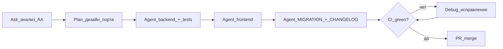

# План миграции AdminAntizapret → AdminPanelAZ

> **Baseline:** [AdminAntizapret](https://github.com/Kirito0098/AdminAntizapret) **1.9.0** → AdminPanelAZ **1.0.0**
> **Цель:** ~**95%+** функционального паритета с upstream + сохранение 🆕-функций AZ (multi-node, 2FA, NOC)
> **Статус переноса:** см. [`MIGRATION.md`](MIGRATION.md) · **Исходники AA:** `/opt/AdminAntizapret`

**Фазы 0–20** (релиз **1.0.0**) закрыты. Оставшиеся 🟡-модули — **фазы 21–29** (релизы **1.1.x–1.3.x**). Каждая фаза = один PR (или пара последовательных PR: backend → frontend).

---

## Режимы Cursor и когда их использовать

| Режим | Когда | Не использовать для |
|-------|-------|---------------------|
| **Ask** | Изучить AA-код, сравнить с AZ, составить diff-план, проверить зависимости | Правок файлов, запуска установки |
| **Plan** | Спроектировать API, схему БД, multi-node адаптацию, разбить большую фазу на PR | Массового копипаста без согласования |
| **Agent** | Порт service/router/UI, тесты, CI, обновление MIGRATION.md | «Угадывания» архитектуры без чтения AA |
| **Debug** | Падающие pytest, CI, интеграция с node agent, race в workers | Новых фич «с нуля» без воспроизведения бага |

### Стандартный цикл переноса одного модуля



### Общие правила для всех промптов

В начале каждого промпта указывайте (агент не должен догадываться):

```
Контекст:
- Источник: /opt/AdminAntizapret (AA 1.9.0)
- Цель: /opt/AdminPanelAZ
- Фаза: N — название
- Ограничения: multi-node через node_adapter.py; не ломать 2FA/NOC/mTLS
- Обновить MIGRATION.md и CHANGELOG.md по завершении
```

---

## Принципы переноса

1. **Backend + тесты → React UI** — service → router → pytest → frontend tab.
2. **Multi-node by design** — все операции с AntiZapret через [`node_adapter.py`](backend/app/services/node_adapter.py).
3. **Не ломать 🆕** — 2FA, refresh tokens, per-node scoping, mTLS остаются.
4. **Один модуль — одна фаза — один PR** — проще ревью и откат.
5. **Обновлять MIGRATION.md** после каждой фазы.

---

## Обзор фаз

| Фаза | Название | Релиз | Режим | Срок |
|------|----------|-------|-------|------|
| 0 | CI pipeline | 0.4.0 | Agent | 1–2 д |
| 1 | pre-commit + test harness | 0.4.0 | Agent | 1–2 д |
| 2 | AdminNotify — анализ | 0.4.1 | Ask → Plan | 0.5 д |
| 3 | AdminNotify — backend | 0.5.0 | Agent | 2–3 д |
| 4 | traffic_limit_notify + хуки | 0.5.0 | Agent | 2 д |
| 5 | AdminNotify — UI + tests | 0.5.0 | Agent | 2 д |
| 6 | AntiZapret config — backend | 0.5.1 | Plan → Agent | 2–3 д |
| 7 | AntiZapret config — frontend | 0.5.1 | Agent | 2 д |
| 8 | Viewer config access UI | 0.5.2 | Agent | 1–2 д |
| 9 | Game filter catalog | 0.5.2 | Agent | 1–2 д |
| 10 | Feature toggles parity | 0.6.0 | Plan → Agent | 2–3 д |
| 11 | WG runtime + policy worker | 0.6.1 | Plan → Agent → Debug | 3–4 д |
| 12 | Action logs CSV export | 0.6.2 | Agent | 1 д |
| 13 | Public routes + OpenVPN group | 0.6.3 | Agent | 2–3 д |
| 14 | BackgroundTaskService | 0.6.4 | Plan → Agent | 3 д |
| 15 | Test suite — волна 1 | 0.6.5 | Agent → Debug | 3–4 д |
| 16 | Sessions + idle restart | 0.7.0 | Plan → Agent | 2–3 д |
| 17 | VPN network UI | 0.7.1 | Plan → Agent | 2–3 д |
| 18 | Global rate limit + security | 0.7.2 | Plan → Agent | 2–3 д |
| 19 | Ops CLI + backup UI + docs | 0.7.3 | Agent | 2–3 д |
| 20 | Final parity audit → 1.0.0 | 1.0.0 | Ask → Agent | 3–5 д |
| 21 | AdminNotify hooks (ban/user/TG) | 1.1.0 | Agent | 2–3 д |
| 22 | Временный IP whitelist UI | 1.1.0 | Agent | 1 д |
| 23 | CIDR presets CRUD | 1.1.1 | Plan → Agent | 3–4 д |
| 24 | QR max downloads + maintenance toggle | 1.1.2 | Agent | 1–2 д |
| 25 | Diff-подсветка в редакторе файлов | 1.2.0 | Plan → Agent | 2–3 д |
| 26 | Test suite — волна 2 | 1.2.1 | Agent → Debug | 4–5 д |
| 27 | CI / pre-commit parity | 1.2.2 | Agent | 1–2 д |
| 28 | VPN-сеть + firewall runtime | 1.3.0 | Plan → Agent → Debug | 5–7 д |
| 29 | Ops console menu (optional) | 1.3.x | Agent | 2–3 д |

```mermaid
flowchart TB
  P0[Ф0_CI] --> P1[Ф1_pre-commit]
  P1 --> P2[Ф2_Ask_AdminNotify]
  P2 --> P3[Ф3_BE_AdminNotify]
  P3 --> P4[Ф4_hooks_notify]
  P4 --> P5[Ф5_UI_AdminNotify]
  P5 --> P6[Ф6_AZ_config_BE]
  P6 --> P7[Ф7_AZ_config_FE]
  P7 --> P8[Ф8_Viewer_UI]
  P8 --> P9[Ф9_Games]
  P9 --> P10[Ф10_Toggles]
  P10 --> P11[Ф11_WG_worker]
  P11 --> P12[Ф12_CSV]
  P12 --> P13[Ф13_Public_routes]
  P13 --> P14[Ф14_BgTasks]
  P14 --> P15[Ф15_Tests]
  P15 --> P16[Ф16_Sessions]
  P16 --> P17[Ф17_VPN_UI]
  P17 --> P18[Ф18_RateLimit]
  P18 --> P19[Ф19_CLI]
  P19 --> P20[Ф20_Release]
  P20 --> P21[Ф21_Notify_hooks]
  P21 --> P22[Ф22_Temp_whitelist]
  P22 --> P23[Ф23_Presets_CRUD]
  P23 --> P24[Ф24_QR_Maint_toggle]
  P24 --> P25[Ф25_Editor_diff]
  P25 --> P26[Ф26_Tests_w2]
  P26 --> P27[Ф27_CI]
  P27 --> P28[Ф28_VPN_firewall]
  P28 --> P29[Ф29_Ops_menu]
```



---

## Фаза 0 — CI pipeline

**Релиз:** 0.4.0 · **Режим:** **Agent**

**Задачи:** порт `.github/workflows/ci.yml` — pytest backend, ruff, `npm run build`, shellcheck scripts.

**Промпт:**

```
Контекст: AdminPanelAZ, фаза 0 — CI pipeline.
Источник CI: /opt/AdminAntizapret/.github/workflows/ci.yml
Цель: /opt/AdminPanelAZ/.github/workflows/ci.yml

Создай GitHub Actions workflow для AdminPanelAZ:
- Python 3.12, pip cache (requirements.txt)
- pytest backend/tests/
- ruff check backend/
- Node 20, npm ci + npm run build во frontend/
- shellcheck scripts/*.sh (если shellcheck доступен)
- без секретов и deploy

По образцу AA, но пути и команды под структуру AZ (backend/, frontend/, scripts/).
Не трогай бизнес-логику. После — кратко опиши как локально воспроизвести CI.
```

---

## Фаза 1 — pre-commit + test harness

**Релиз:** 0.4.0 · **Режим:** **Agent**

**Задачи:** `.pre-commit-config.yaml`, `requirements-dev.txt` (если нет), smoke `test_smoke.py` расширить.

**Промпт:**

```
Контекст: AdminPanelAZ, фаза 1 — pre-commit и test harness.
Источник: /opt/AdminAntizapret/.pre-commit-config.yaml
Цель: /opt/AdminPanelAZ

1. Порт pre-commit: ruff для backend, eslint/prettier для frontend (если есть в AA).
2. Добавь requirements-dev.txt с pytest, ruff, httpx (если нужно для tests).
3. Расширь backend/tests/test_smoke.py — импорт main, health endpoint, список routers.
4. Обнови MIGRATION.md: CI/CD → 🟡 (CI есть, pre-commit есть).
```

---

## Фаза 2 — AdminNotify: анализ и проектирование

**Релиз:** 0.4.1 · **Режим:** **Ask**, затем **Plan**

**Задачи:** карта событий, настроек, зависимостей; без правок кода.

**Промпт (Ask):**

```
Контекст: AdminPanelAZ, фаза 2 — анализ AdminNotify.
Источник: /opt/AdminAntizapret/core/services/admin_notify.py
Также: routes где вызывается AdminNotify, tests/test_admin_notify.py

Проанализируй AdminNotify в AA 1.9.0:
1. Какие типы уведомлений (login, client create/delete, settings change, CPU/RAM)?
2. Откуда берутся chat_id, bot token, флаги вкл/выкл?
3. Где вызывается из routes/services?
4. Что уже есть в AZ (telegram.py, backup_scheduler, maintenance test TG)?

Выдай таблицу: событие AA → hook point AA → предложенный hook AZ → нужен ли node_id в тексте.
Не редактируй файлы.
```

**Промпт (Plan):**

```
На основе анализа AdminNotify составь план порта в AdminPanelAZ:
- Файл backend/app/services/admin_notify.py
- Интеграция с app/services/telegram.py и feature toggle telegram
- Список routers для хуков (фаза 4)
- Pydantic settings / AppSetting keys
- Тесты для переноса
- Что НЕ переносим

Один PR = только backend service без хуков. Оценка строк/файлов.
```

---

## Фаза 3 — AdminNotify: backend

**Релиз:** 0.5.0 · **Режим:** **Agent**

**Промпт:**

```
Контекст: AdminPanelAZ, фаза 3 — AdminNotify backend.
Источник: /opt/AdminAntizapret/core/services/admin_notify.py
Цель: /opt/AdminPanelAZ/backend/app/services/admin_notify.py
План: [вставить вывод фазы 2 Plan]

Портируй AdminNotifyService:
- FastAPI/async-friendly или sync как в AA — следуй стилю telegram.py в AZ
- Настройки через AppSetting / существующий паттерн settings
- Методы send_* для каждого типа уведомления
- Unit-тесты: порт test_admin_notify.py с моками Telegram API
- Пока БЕЗ хуков в routers (это фаза 4)
- Обнови MIGRATION.md: Telegram admin → 🟡 (service готов)
```

---

## Фаза 4 — traffic_limit_notify + хуки AdminNotify

**Релиз:** 0.5.0 · **Режим:** **Agent**

**Промпт:**

```
Контекст: AdminPanelAZ, фазы 4 — traffic_limit_notify и хуки AdminNotify.
Источники:
- /opt/AdminAntizapret/core/services/traffic_limit_notify.py
- /opt/AdminAntizapret/utils/traffic_limit_reconcile.py (где вызывается notify)
- admin_notify call sites в AA routes

1. Порт traffic_limit_notify.py → backend/app/services/traffic_limit_notify.py
2. Вызов из traffic_limit_reconcile.py при превышении лимита
3. Хуки AdminNotify:
   - auth.py — успешный login (не viewer test accounts)
   - configs.py — create/delete client
   - settings.py — критичные изменения (по AA)
   - server_monitor.py — пороги CPU/RAM (если есть в AA)
4. В текстах уведомлений: имя узла / node_id (multi-node)
5. Тесты: test_traffic_limit_notify.py
6. Feature toggle: не слать если telegram disabled

Минимальный diff. Обнови MIGRATION.md.
```

---

## Фаза 5 — AdminNotify: UI + интеграционные tests

**Релиз:** 0.5.0 · **Режим:** **Agent** · при падении CI → **Debug**

**Промпт:**

```
Контекст: AdminPanelAZ, фаза 5 — UI настроек AdminNotify.
Backend: admin_notify.py, traffic_limit_notify.py уже есть.

1. API GET/PUT /api/settings/admin-notify (или расширь settings router) — флаги типов уведомлений как в AA
2. TelegramTab.tsx — секция «Уведомления администратору» (toggle по типам)
3. Integration test: login → mock telegram called
4. Обнови MIGRATION.md: Telegram admin-уведомления → ✅ (или 🟡 с пояснением)
5. CHANGELOG.md [0.5.0]
```

**Промпт (Debug, если тесты падают):**

```
pytest backend/tests/test_admin_notify.py падает: [вставить traceback]

Исправь без изменения контракта API. Проверь моки telegram.py и порядок импортов в conftest.
```

---

## Фаза 6 — AntiZapret config: backend

**Релиз:** 0.5.1 · **Режим:** **Plan** → **Agent**

**Промпт (Plan):**

```
Контекст: фаза 6 — вкладка «Конфиг AntiZapret».
Источники AA:
- core/services/antizapret_settings.py
- routes/settings/antizapret.py
- templates/partials/routing/_tab_antizapret_config.html

Спроектируй:
- GET/PUT /api/routing/antizapret-settings
- Schema полей (какие файлы/ключи AntiZapret на узле)
- Чтение/запись через node_adapter (local + remote)
- Валидация и apply
- Связь с POST /api/routing/apply
```

**Промпт (Agent):**

```
Реализуй план фазы 6:
- backend/app/services/antizapret_settings.py
- router в routing.py или отдельный
- pytest по образцу AA routing tests
- feature guard: routing enabled
- node_id из активного узла NodeContext
- MIGRATION.md: «Конфиг AntiZapret» backend → 🟡
```

---

## Фаза 7 — AntiZapret config: frontend

**Релиз:** 0.5.1 · **Режим:** **Agent**

**Промпт:**

```
Контекст: AdminPanelAZ, фаза 7 — UI AntiZapret config.
Backend API готов: /api/routing/antizapret-settings

1. Создай AntizapretConfigTab.tsx по UX AA _tab_antizapret_config.html
2. Подключи в RoutingPage.tsx (tabs как у других routing tabs)
3. Форма: load settings, edit, save, apply (с confirm dialog)
4. Loading/error states как в ProvidersTab
5. MIGRATION.md: «Конфиг AntiZapret» → ✅
6. CHANGELOG [0.5.1]
```

---

## Фаза 8 — Viewer config access UI

**Релиз:** 0.5.2 · **Режим:** **Agent**

**Промпт:**

```
Контекст: AdminPanelAZ, фаза 8 — UI viewer config access.
API уже есть: GET/PUT /api/system/viewer-access в system.py

1. UsersTab.tsx — для пользователя с ролью viewer/user: UI выбора групп/конфигов
2. Используй существующие API client.ts patterns
3. Проверь backend guards на configs router — viewer видит только разрешённые
4. Добавь test_node_scoping или test в test_security.py
5. MIGRATION.md: Viewer role → ✅
```

---

## Фаза 9 — Game filter catalog

**Релиз:** 0.5.2 · **Режим:** **Agent**

**Промпт:**

```
Контекст: AdminPanelAZ, фаза 9 — полный game filter catalog.
Источник: /opt/AdminAntizapret/core/services/cidr/provider_sources.py (GAME_FILTER_CATALOG ~75 игр)
Цель: backend/app/services/cidr/game_catalog.py (сейчас 15 игр)

1. Синхронизируй catalog с AA 1.9.0 (структура dict key/label/... как в AZ)
2. Порт test_game_catalog_coverage.py, test_catalog_data.py
3. Проверь GameFiltersTab.tsx — pagination/search если catalog большой
4. Не дублируй catalog в provider_sources.py если есть game_catalog.py
5. MIGRATION.md: Game filters → ✅
6. CHANGELOG [0.5.2]
```

---

## Фаза 10 — Feature toggles parity

**Релиз:** 0.6.0 · **Режим:** **Plan** → **Agent**

**Промпт (Plan):**

```
Сравни feature toggles AA 1.9.0 (feature_toggles.py) и AZ (backend/app/services/feature_toggles.py).
Составь таблицу: toggle AA → ключ AZ → router/UI guard → фаза реализации worker (11, 16, 19).
Отдельно: background toggles WG_POLICY_SYNC, RUNTIME_BACKUP_CLEANUP, ACTIVE_SESSION_TRACKING, NIGHTLY_IDLE_RESTART.
```

**Промпт (Agent):**

```
Реализуй недостающие UI toggles (не workers):
FEATURE_AMNEZIAWG_ENABLED, FEATURE_USER_MANAGEMENT_ENABLED, FEATURE_ACTION_LOGS_ENABLED,
FEATURE_SYSTEM_UPDATES_ENABLED, FEATURE_QR_DOWNLOADS_ENABLED, FEATURE_VPN_NETWORK_ENABLED (stub)

- feature_toggles.py + feature_guards.py
- FeatureTogglesTab.tsx
- FeatureGuardRoute / backend 403
- test_feature_guards.py расширить
- MIGRATION.md: Feature toggles → 🟡 (UI parity, workers в фазах 11/16/19)
```

---

## Фаза 11 — WG runtime + policy sync worker

**Релиз:** 0.6.1 · **Режим:** **Plan** → **Agent** → **Debug**

**Промпт (Plan):**

```
Источники AA:
- core/services/wg_access_policy.py
- utils/wg_awg_runtime_apply.py
- core/services/wg_awg_runtime_enforcer.py

AZ сейчас: access_policy.py, wg_runtime.py (упрощённо)

Спроектируй доведение до паритета + worker WG_POLICY_SYNC:
- что выполняется на controller vs node agent
- расписание (как cidr_scheduler.py)
- per-node через node_adapter
```

**Промпт (Agent):**

```
Реализуй план фазы 11:
- Расширь wg_runtime.py
- Worker wg_policy_sync_worker.py + toggle WG_POLICY_SYNC
- Порт test_wg_access_policy_service.py
- Multi-node: policy apply на каждом узле отдельно
- MIGRATION.md: WG/AWG runtime → ✅
```

---

## Фаза 12 — Action logs CSV export

**Релиз:** 0.6.2 · **Режим:** **Agent**

**Промпт:**

```
Контекст: фаза 12 — экспорт action logs.
Источник AA: /api/settings/action-logs/export

1. GET /api/logs/action-logs/export в logs.py — CSV stream, admin only
2. Кнопка в LogsPage.tsx, download через api client
3. Тест: создать log entry → export → проверить CSV header и row
4. MIGRATION.md: Журнал действий → ✅
```

---

## Фаза 13 — Public routes + OpenVPN UDP/TCP group

**Релиз:** 0.6.3 · **Режим:** **Agent**

**Промпт:**

```
Контекст: фаза 13 — публичные route-файлы и OpenVPN group.
Источник AA: config_routes.py — /public_download/<router>, /toggle_public_download, /set_openvpn_group

ВАЖНО: не путать с QR one-time links (public_download.py уже есть для QR).

1. Endpoints для Keenetic, MikroTik, TP-Link route files
2. toggle_public_download — AppSetting + API
3. set_openvpn_group — через node_adapter + UI в ClientActionsDialog
4. Feature guard: openvpn + security
5. Tests по образцу test_config_routes_*
6. MIGRATION.md: три строки VPN-клиенты ❌ → ✅
```

---

## Фаза 14 — BackgroundTaskService

**Релиз:** 0.6.4 · **Режим:** **Plan** → **Agent**

**Промпт (Plan):**

```
Источник: /opt/AdminAntizapret/core/services/background_tasks.py
AZ: ProgressContext.tsx, cidr_tasks, tests.py — разрозненный progress

Спроектируй единый BackgroundTaskService:
- task id, status, progress %, message
- API GET /api/tasks/{id}
- интеграция: routing apply, maintenance doall, system update
```

**Промпт (Agent):**

```
Реализуй BackgroundTaskService по плану.
Подключи к POST /api/routing/apply и maintenance doall.
ProgressContext.tsx — polling или SSE если уже есть паттерн.
Порт test_background_tasks_service.py.
MIGRATION.md: Прогресс фоновых задач → ✅
```

---

## Фаза 15 — Test suite: волна 1

**Релиз:** 0.6.5 · **Режим:** **Agent** → **Debug**

**Промпт:**

```
Контекст: фаза 15 — расширение pytest (волна 1).
Источник tests/: /opt/AdminAntizapret/tests/

Портируй с адаптацией под FastAPI + node_adapter (приоритет):
- test_openvpn_access_policy_service.py
- test_traffic_limit.py
- test_http_security.py
- test_edit_files_page_context.py → API tests
- test_ip_restriction_scanner_block.py

Используй httpx AsyncClient, fixtures из conftest.py.
Цель: минимум +15 test modules, CI green.
MIGRATION.md: In-panel pytest → 🟡 (указать число модулей)
```

---

## Фаза 16 — Sessions + idle restart

**Релиз:** 0.7.0 · **Режим:** **Plan** → **Agent**

**Промпт (Plan):**

```
Источники AA:
- core/services/active_web_session.py
- utils/nightly_idle_restart.py
- /api/session-heartbeat

AZ: JWT + refresh tokens (🆕) — спроектируй совместимость:
- нужен ли heartbeat при JWT?
- ACTIVE_SESSION_TRACKING toggle
- NIGHTLY_IDLE_RESTART worker
```

**Промпт (Agent):**

```
Реализуй фазу 16 по плану.
Не ломай refresh token flow.
Toggle ACTIVE_SESSION_TRACKING, NIGHTLY_IDLE_RESTART.
MIGRATION.md: session heartbeat, active session, nightly restart → ✅/🟡
```

---

## Фаза 17 — VPN network UI

**Релиз:** 0.7.1 · **Режим:** **Plan** → **Agent**

**Промпт:**

```
Контекст: фаза 17 — VPN-сеть из UI.
Источник AA: templates/partials/settings/_tab_vpn_network.html, settings routes

1. Plan: какие поля editable vs read-only (nginx уже через scripts/nginx-setup.sh)
2. VpnNetworkTab.tsx — режим HTTPS, domain, BEHIND_NGINX (read + ссылка на nginx-setup.sh)
3. API GET settings/vpn-network — без shell exec из UI без confirm
4. FEATURE_VPN_NETWORK_ENABLED guard
5. MIGRATION.md: VPN-сеть → 🟡 или ✅
```

---

## Фаза 18 — Global rate limit + security parity

**Релиз:** 0.7.2 · **Режим:** **Plan** → **Agent**

**Промпт (Plan):**

```
Сравни AA http_security.py + Flask-Limiter с AZ middleware/http_security.py + auth_rate_limit.py.
Составь план global API rate limiting (Redis, per-IP, исключения для health/static).
```

**Промпт (Agent):**

```
Реализуй global rate limit middleware.
Расширь security.py до паритета с AA (без отката 🆕 2FA).
Tests: test_http_security.py порт.
MIGRATION.md: Безопасность → ✅, global rate limit → ✅
```

---

## Фаза 19 — Ops CLI + backup UI + docs

**Релиз:** 0.7.3 · **Режим:** **Agent**

**Промпт:**

```
Контекст: фаза 19 — ops и документация.

1. scripts/site-diagnostics.sh — порт site_diagnostics.sh (адаптировать пути AZ)
2. scripts/safe-browsing-status.py — порт safe_browsing_status_cli.py
3. BackupTab.tsx — опция бэкапа AntiZapret (client.sh 8) через node_adapter, toggle RUNTIME_BACKUP_CLEANUP worker в backup_scheduler.py
4. docs/Telegram.md — документация TG (Login, Mini App, AdminNotify, backups)
5. MIGRATION.md: установка/ops, бэкап client.sh 8, Telegram.md → ✅/🟡
```

---

## Фаза 20 — Final parity audit → 1.0.0

**Релиз:** 1.0.0 · **Режим:** **Ask** → **Agent**

**Промпт (Ask):**

```
Проверь MIGRATION.md построчно против кода /opt/AdminPanelAZ и /opt/AdminAntizapret.
Список: строки где статус завышен (✅ но код incomplete) или занижен (🟡 но уже ✅).
Test count: pytest --collect-only.
Не редактируй файлы.
```

**Промпт (Agent):**

```
По аудиту фазы 20:
1. Исправь расхождения MIGRATION.md
2. Test suite волна 2 — добрать критичные tests из AA до ~40 modules
3. README — секция «Production readiness» (чеклист, что 🆕 в AZ сверх AA)
4. CHANGELOG [1.0.0]
5. MIGRATION.md: baseline AZ 1.0.0, обновлено [дата]
```

---

## Фазы 21–29 — закрытие 🟡 после 1.0.0

> Источник пробелов: секция «Backlog переноса» и сводная таблица 🟡 в [`MIGRATION.md`](MIGRATION.md).

| Приоритет | Фаза | Effort | Закрывает в MIGRATION.md |
|-----------|------|--------|--------------------------|
| Высокий | 21–23 | S–M | AdminNotify, temp whitelist, CIDR presets |
| Средний | 24–27 | S–L | QR max downloads, FEATURE_MAINTENANCE, editor diff, tests, CI |
| Низкий | 28–29 | L–S | VPN-сеть mutations, panel_port_firewall, adminpanel menu |

**Рекомендуемый первый спринт (1.1.0):** фазы **21 + 22** (backend для 22 готов; для 21 — только wiring хуков).

---

## Фаза 21 — AdminNotify hooks (ban / user / TG unlink)

**Релиз:** 1.1.0 · **Режим:** **Agent** · **Срок:** 2–3 д

**Задачи:** методы `send_client_ban`, `send_user_create`, `send_user_delete`, `send_tg_login_unlinked` уже есть в `admin_notify.py`, но не вызываются из роутеров.

**Эталон AA:** `core/services/settings/post_handlers/users.py`, `app.py` (event mapping), `routes/auth_routes.py`.

**Промпт:**

```
Контекст: AdminPanelAZ, фаза 21 — AdminNotify hooks.
Источник AA: /opt/AdminAntizapret (core/services/admin_notify.py, settings/post_handlers/users.py, app.py)
Цель: /opt/AdminPanelAZ
Ограничения: multi-node — передавать node_id/node_name в send_client_ban; не ломать 2FA/NOC/mTLS

1. backend/app/routers/users.py — после create/delete → admin_notify_service.send_user_create / send_user_delete
2. backend/app/routers/client_access.py — после OVPN/WG temp/permanent block и unblock → send_client_ban (details: срок, тип протокола)
3. backend/app/routers/auth.py — при отвязке Telegram → send_tg_login_unlinked (mini=false/true)
4. Учитывать toggles событий из TelegramTab (admin notify settings)
5. Tests: расширить backend/tests/test_admin_notify_integration.py
6. MIGRATION.md: Telegram admin-уведомления → ✅
7. CHANGELOG [1.1.0]
```

---

## Фаза 22 — Временный IP whitelist UI

**Релиз:** 1.1.0 · **Режим:** **Agent** · **Срок:** 1 д

**Задачи:** API `POST /api/security/temp-whitelist` и тесты уже есть; нет UI в SecurityTab.

**Эталон AA:** `templates/partials/settings/_tab_security.html` (radio 1h/12h/24h, список temp entries).

**Промпт:**

```
Контекст: AdminPanelAZ, фаза 22 — временный IP whitelist UI.
Источник AA: templates/partials/settings/_tab_security.html
Цель: frontend/src/components/settings/SecurityTab.tsx + api/client.ts

Backend готов: POST /api/security/temp-whitelist (security.py).

1. Radio 1h / 12h / 24h + кнопка «Добавить текущий IP» (или поле IP + duration)
2. Таблица settings.temp_whitelist (IP, срок, hours) — данные из GET security settings
3. При необходимости — DELETE endpoint для удаления temp IP (минимальный, parity AA remove_temp_ip)
4. Disabled когда ip_restriction_enabled=false
5. MIGRATION.md: «Временный whitelist» → ✅
```

---

## Фаза 23 — CIDR presets CRUD

**Релиз:** 1.1.1 · **Режим:** **Plan** → **Agent** · **Срок:** 3–4 д

**Задачи:** `CidrDbUpdaterService.create/update/delete/reset` в `db_service.py` есть; роутов и UI нет (только apply + seed).

**Эталон AA:** `routes/settings/api_cidr_db.py` (`/api/cidr-presets`), `static/assets/js/routing-page-extra.js`.

**Промпт (Plan):**

```
Сравни AA /api/cidr-presets (GET/POST/PUT/DELETE/reset) с AZ backend/app/services/cidr/pipeline/db_service.py.
Спроектируй REST в cidr_db.py, Pydantic-схемы, feature guard routing.
PR1: backend + tests; PR2: PresetsTab.tsx CRUD UI.
```

**Промпт (Agent):**

```
Контекст: фаза 23 — CIDR presets CRUD.
Источник AA: routes/settings/api_cidr_db.py, routing-page-extra.js
Цель: backend/app/routers/cidr_db.py, frontend/src/components/routing/PresetsTab.tsx

1. GET/POST /api/cidr-db/presets, PUT/DELETE /presets/{id}, POST /presets/{id}/reset
2. PresetsTab: create/edit modal, delete custom, reset builtin, multi-select providers
3. Tests: порт test_settings_api_cidr_games.py (presets часть)
4. MIGRATION.md: «Пресеты CIDR», «Маршрутизация / CIDR» → ✅
5. CHANGELOG [1.1.1]
```

---

## Фаза 24 — QR max downloads + FEATURE_MAINTENANCE

**Релиз:** 1.1.2 · **Режим:** **Agent** · **Срок:** 1–2 д

**Задачи:** `qr_download_max_downloads` сохраняется через API, но input в SecurityTab отсутствует; нет toggle `FEATURE_MAINTENANCE_ENABLED`.

**Эталон AA:** `_tab_security.html` (max downloads), `feature_toggles.py` (FEATURE_MAINTENANCE_ENABLED).

**Промпт:**

```
Контекст: фаза 24 — QR max downloads + maintenance toggle.
Источник AA: env_defaults.sh, core/services/feature_toggles.py
Цель: /opt/AdminPanelAZ

24a — SecurityTab.tsx: поле «Макс. скачиваний» для qr_download_max_downloads (backend уже принимает)

24b — FEATURE_MAINTENANCE_ENABLED:
- backend/app/services/feature_toggles.py — definition + env_defaults.sh
- feature_guards.py — guard MaintenanceTab routes (/api/maintenance/*)
- FeatureTogglesTab если не подхватится автоматически
- test_feature_guards.py

MIGRATION.md: QR-настройки → ✅, FEATURE_MAINTENANCE → ✅, Feature toggles → ✅
CHANGELOG [1.1.2]
```

---

## Фаза 25 — Diff-подсветка в редакторе файлов

**Релиз:** 1.2.0 · **Режим:** **Plan** → **Agent** · **Срок:** 2–3 д

**Задачи:** React-редактор без diff; AA использует `edit_files/diff.js`.

**Промпт (Plan):**

```
Изучи AA static edit_files/diff.js и EditFilesPage.tsx в AZ.
Выбери подход: react-diff-viewer / Monaco diff / inline highlight.
Backend изменений не требуется, если файл уже читается через file_editor.py.
```

**Промпт (Agent):**

```
Контекст: фаза 25 — diff в редакторе файлов.
Источник AA: edit_files/diff.js
Цель: frontend/src/pages/EditFilesPage.tsx

1. Кнопка «Сравнить с диском» — diff между textarea и содержимым с node
2. Подсветка добавленных/удалённых строк перед Apply
3. MIGRATION.md: «Diff-подсветка» → ✅
CHANGELOG [1.2.0]
```

---

## Фаза 26 — Test suite — волна 2

**Релиз:** 1.2.1 · **Режим:** **Agent** → **Debug** · **Срок:** 4–5 д

**Задачи:** 40 модулей / 240 тестов в AZ vs 53 в AA; часть AA-тестов Jinja-specific и не портируется.

**Не портируем:** `test_jinja_templates_compile.py`, `test_*_page_context.py`, `test_script_executor.py`.

**Портировать (~10 модулей):**

| AA | AZ действие |
|----|-------------|
| `test_settings_api_cidr_games.py` | фаза 23 |
| `test_cidr_db_updater_service.py` | новый |
| `test_cidr_list_updater.py` | новый |
| `test_config_routes_openvpn_block.py` | client_access + notify |
| `test_panel_port_firewall.py` | фаза 28 или отдельно |
| `test_ip_restriction_whitelist_firewall_gating.py` | security router |
| `test_settings_post_handlers.py` | users + notify (фаза 21) |
| `test_access_remaining.py` | access_policy |
| `test_maintenance_scheduler_backup.py` | backup_scheduler |
| `test_db_migration_service.py` | database migrations |
| `test_system_preflight.py` | install/preflight scripts |

**Промпт:**

```
Контекст: фаза 26 — test suite wave 2.
Источник: /opt/AdminAntizapret/tests/
Цель: backend/tests/

1. pytest --collect-only в AA и AZ — список gap
2. Портировать критичные модули из таблицы фазы 26 (пропустить Jinja-specific)
3. Цель: ~48–50 pytest modules (не 53 — часть AA не применима к FastAPI/React)
4. CI green
5. MIGRATION.md: In-panel pytest → 🟡 с обновлённым count или ✅ если ≥48 modules
CHANGELOG [1.2.1]
```

---

## Фаза 27 — CI / pre-commit parity

**Релиз:** 1.2.2 · **Режим:** **Agent** · **Срок:** 1–2 д

**Задачи:** AZ CI — pytest, ruff, shellcheck, build; нет eslint, pip-audit, bandit (advisory как в AA).

**Эталон AA:** `.github/workflows/ci.yml`, `.pre-commit-config.yaml`.

**Промпт:**

```
Контекст: фаза 27 — CI и pre-commit parity.
Источник AA: .github/workflows/ci.yml, .pre-commit-config.yaml
Цель: /opt/AdminPanelAZ

1. CI: npm run lint (eslint) во frontend/
2. CI: pip-audit, bandit — continue-on-error (advisory, как в AA)
3. pre-commit: eslint + bandit hooks (optional, non-blocking)
4. MIGRATION.md: CI/CD, pre-commit → ✅
CHANGELOG [1.2.2]
```

---

## Фаза 28 — VPN-сеть + firewall runtime

**Релиз:** 1.3.0 · **Режим:** **Plan** → **Agent** → **Debug** · **Срок:** 5–7 д

**Задачи:** VpnNetworkTab read-only; мутации порта/nginx через `install.sh` / `nginx-setup.sh`; нет runtime `panel_port_firewall.py`.

**Риск:** высокий на production — начинать с Plan.

**Промпт (Plan):**

```
Сравни AA _tab_vpn_network.html + post handlers с AZ VpnNetworkTab (read-only).
Сравни AA panel_port_firewall.py с AZ scripts/firewall-setup.sh.
Решение: full parity vs guided wizard (background task → nginx-setup.sh) vs ops-only (документировать).
Multi-node: мутации только на controller.
```

**Промпт (Agent):**

```
Контекст: фаза 28 — VPN network + firewall runtime (по Plan).
Источник AA: _tab_vpn_network.html, panel_port_firewall.py
Цель: settings router, VpnNetworkTab, ip_restriction/security

28a — VPN network: guided wizard или editable fields + confirm + BackgroundTaskService
28b — panel_port_firewall parity: runtime iptables/ipset для whitelist порта панели
28c — Tests: test_panel_port_firewall.py, test_vpn_network_settings.py
MIGRATION.md: VPN-сеть, firewall panel port → ✅ или 🟡 с явным ops-only решением
CHANGELOG [1.3.0]
```

---

## Фаза 29 — Ops console menu (optional)

**Релиз:** 1.3.x · **Режим:** **Agent** · **Срок:** 2–3 д · **Приоритет:** низкий

**Задачи:** AA `adminpanel.sh` — интерактивное меню restart/update/backup/tests; AZ — `install.sh` + systemd.

**Промпт:**

```
Контекст: фаза 29 — ops console menu (optional).
Источник AA: script_sh/adminpanel.sh
Цель: scripts/adminpanel-menu.sh

Обёртка: restart panel, run backup, run pytest, git update — через start.sh, systemd, существующие scripts.
Не дублировать install.sh wizard.
MIGRATION.md: adminpanel.sh menu → ✅ или оставить 🟡 «ops-only via systemd»
CHANGELOG [1.3.x]
```

---

## Дорожная карта релизов

| Версия | Фазы | Фокус |
|--------|------|-------|
| **0.4.0** | 0–1 | CI, pre-commit, smoke tests |
| **0.4.1** | 2 | AdminNotify design |
| **0.5.0** | 3–5 | AdminNotify + traffic limit notify |
| **0.5.1** | 6–7 | AntiZapret config tab |
| **0.5.2** | 8–9 | Viewer UI, game catalog |
| **0.6.0** | 10 | Feature toggles UI |
| **0.6.1** | 11 | WG policy worker |
| **0.6.2** | 12 | Action logs CSV |
| **0.6.3** | 13 | Public routes, OpenVPN group |
| **0.6.4** | 14 | BackgroundTaskService |
| **0.6.5** | 15 | Test suite wave 1 |
| **0.7.0** | 16 | Sessions |
| **0.7.1** | 17 | VPN network UI |
| **0.7.2** | 18 | Rate limit + security |
| **0.7.3** | 19 | Ops CLI, docs |
| **1.0.0** | 20 | Parity audit, release |
| **1.1.0** | 21–22 | AdminNotify hooks, temp whitelist UI |
| **1.1.1** | 23 | CIDR presets CRUD |
| **1.1.2** | 24 | QR max downloads, FEATURE_MAINTENANCE |
| **1.2.0** | 25 | Editor diff |
| **1.2.1** | 26 | Test suite wave 2 |
| **1.2.2** | 27 | CI / pre-commit parity |
| **1.3.0** | 28 | VPN network + firewall runtime |
| **1.3.x** | 29 | Ops console menu (optional) |

---

## Чеклист после каждой фазы

- [ ] Код в отдельном PR (backend / frontend раздельно при большой фазе)
- [ ] `pytest` и `npm run build` локально или CI green
- [ ] Multi-node: проверен local node; remote — если фаза трогает antizapret на узле
- [ ] [`MIGRATION.md`](MIGRATION.md) — статусы и «Обновлено»
- [ ] [`CHANGELOG.md`](CHANGELOG.md) — версия релиза
- [ ] Промпт следующей фазы можно запускать без доп. контекста

---

## Риски и ограничения

| Риск | Митигация |
|------|-----------|
| Слишком большой PR | Дробить фазу: Plan явно указывает «PR1 backend, PR2 frontend» |
| Agent «галлюцинирует» API AA | Всегда начинать фазу с Ask + путь к файлу AA |
| JWT vs session AA | Фазы 16/18 — только Plan сначала |
| Multi-node | В каждом промпте: node_adapter, node_id |
| Регрессия 🆕 | После фазы 20 — smoke: 2FA, NodesPage, MonitoringPage |
| VPN/nginx из UI (фаза 28) | Начинать с Plan; guided wizard + confirm; rollback; ops-only допустим |

---

## Что не переносить (осознанно)

- Flask monolith `app.py` → FastAPI routers
- Jinja2 templates → React SPA
- `client.sh` в репозитории → AntiZapret на сервере
- Полная копия `adminpanel.sh` → `install.sh` + systemd + optional CLI (фаза 29)

---

## Связанные документы

- [`MIGRATION.md`](MIGRATION.md) — текущий статус переноса (✅ / 🟡 / ❌)
- [`README.md`](README.md) — установка, multi-node, краткая сводка
- [`CHANGELOG.md`](CHANGELOG.md) — история версий AdminPanelAZ
- [`SECURITY.md`](SECURITY.md) — hardening, JWT, rate limits, mTLS
