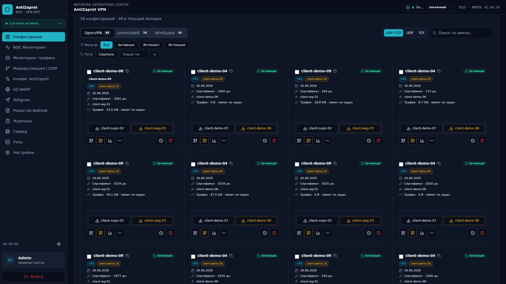
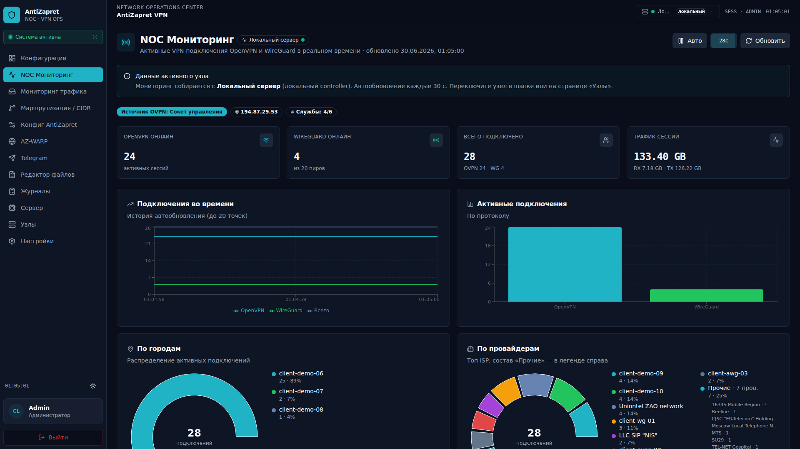
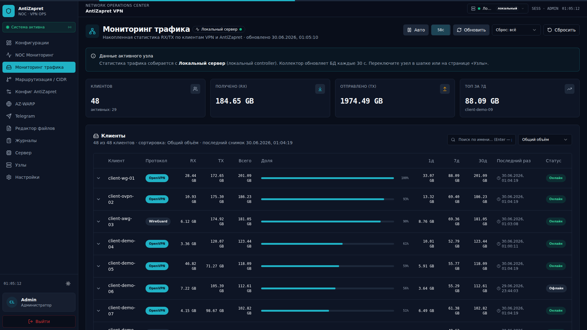

<div align="center">

# AdminPanel AntiZapret

**Веб-панель для администрирования VPN-сервера [AntiZapret](https://github.com/GubernievS/AntiZapret-VPN)**

[](https://github.com/Kirito0098/AdminPanelAZ)
[](backend/)
[](frontend/)

[Установка](#установка) · [Возможности](#возможности) · [Руководства](docs/README.md) · [Безопасность](SECURITY.md) · [Changelog](CHANGELOG.md)

<br />

<p align="center">
  <br /><br />
  <br /><br />
  
</p>

*Скриншоты интерфейса (1920×1080); имена клиентов заменены на демо-значения.*

</div>

---

> **⚠️ Статус проекта**
>
> Проект на этапе **переноса и тестирования**. Долгосрочная поддержка ещё не определена.
>
> Альтернатива на Flask — [AdminAntizapret](https://github.com/Kirito0098/AdminAntizapret).

Панель помогает администрировать VPN: клиенты, маршрутизация, мониторинг, бэкапы и Telegram.

| Для кого | Куда идти |
|----------|-----------|
| Пользователи и администраторы | **[docs/README.md](docs/README.md)** — простые инструкции по каждому разделу |
| Разработчики | [SECURITY.md](SECURITY.md) · [CHANGELOG.md](CHANGELOG.md) · [docs/PROJECT_MAP.md](docs/PROJECT_MAP.md) |

## Содержание

- [Возможности](#возможности)
- [Установка](#установка)
- [Руководства пользователя](#руководства-пользователя)
- [Бесплатный адрес (DDNS)](#бесплатный-адрес-для-панели-ddns)
- [Production: VDS, Redis и профили](#production-vds-redis-и-профили)
- [Безопасность](#безопасность)
- [Полезные команды](#полезные-команды-на-сервере)
- [История изменений](#история-изменений)

---

## Возможности

### VPN и клиенты

- OpenVPN, WireGuard, AmneziaWG — создание, скачивание, QR-коды ([инструкция](docs/konfiguracii.md))
- Блокировка, срок действия, лимиты трафика
- Несколько VPN-серверов (узлов) из одной панели ([инструкция](docs/uzly.md))

### Маршрутизация

- Списки провайдеров (CIDR), пресеты, конфиг AntiZapret ([маршрутизация](docs/routing-cidr.md), [конфиг](docs/antizapret-config.md))
- Редактор файлов AntiZapret с применением на сервер ([инструкция](docs/edit-files.md))
- AZ-WARP — точечная маршрутизация через Cloudflare WARP ([инструкция](docs/warper.md))

### Мониторинг

- **NOC** — кто подключён, откуда (город и провайдер), графики, состояние служб ([инструкция](docs/noc-monitoring.md))
- **Трафик** — расход по клиентам, лимиты, детальный разбор ([инструкция](docs/traffic-monitoring.md))
- **Сервер** — нагрузка CPU/RAM, vnStat ([инструкция](docs/server-monitor.md))
- **Локальная GeoIP** — MaxMind GeoLite2 в `data/geoip/` ([инструкция](docs/GeoIP.md))

### Безопасность и администрирование

- Роли: администратор, пользователь, наблюдатель ([пользователи](docs/nastrojki/polzovateli.md))
- 2FA, белый список IP, защита от перебора паролей ([безопасность](docs/nastrojki/bezopasnost.md))
- Бэкапы вручную и по расписанию, отправка в Telegram ([инструкция](docs/nastrojki/rezervnye-kopii.md))

### Telegram

- Вход через Telegram, Mini App, бот, уведомления ([инструкция](docs/Telegram.md))

---

## Установка

| | |
|---|---|
| **ОС** | Ubuntu 24.04+ или Debian 13+ |
| **Права** | root / sudo, доступ в интернет |
| **AntiZapret** | Ставится **отдельно** на VPN-сервер — см. [AntiZapret-VPN](https://github.com/GubernievS/AntiZapret-VPN) |

### Быстрый старт

<details>
<summary><strong>Простая установка</strong> — рекомендуется новичкам (понятные вопросы с пояснениями)</summary>

```bash
sudo apt update && sudo apt install -y git wget curl
wget -qO /tmp/install-easy.sh https://raw.githubusercontent.com/Kirito0098/AdminPanelAZ/refs/heads/main/install-easy.sh
sudo bash /tmp/install-easy.sh
```

Мастер спросит:

1. **Что ставим** — только панель, панель + VPN на этом сервере, или связь VPN-сервера с панелью
2. **Как заходить в браузере** — свой домен, бесплатный DuckDNS, или только на этом сервере
3. **Логин и пароль** администратора
4. **Размер сервера** — 1 GB (облегчённый) или 2 GB+ (обычный)
5. **Автозапуск** — включается автоматически (рекомендуется)

</details>

<details>
<summary><strong>Полный установщик</strong> — больше настроек (порты, firewall, Telegram и др.)</summary>

```bash
sudo apt update && sudo apt install -y git wget curl
wget -qO /tmp/install.sh https://raw.githubusercontent.com/Kirito0098/AdminPanelAZ/refs/heads/main/install.sh
sudo bash /tmp/install.sh
```

Мастер спросит:

1. **Тип** — только панель, панель + VPN на этом сервере, или только агент на VPN-сервере
2. **Домен или DDNS** — DuckDNS / No-IP / свой домен
3. **HTTPS** — Let's Encrypt (рекомендуется) или самоподписанный сертификат
4. **Логин и пароль** администратора
5. **Автозапуск** — для постоянной работы выберите systemd

</details>

> **Важно:** запускайте установщик **из SSH-терминала**, не через `curl | bash` — иначе не откроется интерактивный мастер.

**Уже скачали репозиторий:**

```bash
cd /opt/AdminPanelAZ
sudo ./install-easy.sh    # простой мастер
sudo ./install.sh         # полный мастер
```

### После установки

| Шаг | Действие |
|-----|----------|
| 1 | Откройте URL из вывода установщика |
| 2 | Войдите под созданным администратором |
| 3 | **Смените пароль** и включите **2FA** — [Настройки → Профиль](docs/nastrojki/profil.md) |
| 4 | Если VPN на другом сервере — добавьте узел — [Узлы](docs/uzly.md) |
| 5 | На **Конфигурации** нажмите **Синхронизировать** — [инструкция](docs/konfiguracii.md) |

> **Вход по умолчанию** (если не задавали в мастере): `admin` / `admin` — смените сразу.

### Удаление и переустановка

```bash
sudo ./install.sh              # меню: переустановка или удаление
sudo ./install.sh --uninstall  # удалить сервисы панели
```

AntiZapret и VPN-конфиги при удалении панели **не трогаются**.

---

## Руководства пользователя

Полный список инструкций: **[docs/README.md](docs/README.md)**

| Тема | Ссылка |
|------|--------|
| VPN-клиенты | [docs/konfiguracii.md](docs/konfiguracii.md) |
| Несколько серверов | [docs/uzly.md](docs/uzly.md) |
| NOC и трафик | [docs/noc-monitoring.md](docs/noc-monitoring.md) · [docs/traffic-monitoring.md](docs/traffic-monitoring.md) |
| Настройки и бэкапы | [docs/nastrojki/README.md](docs/nastrojki/README.md) |
| Telegram | [docs/Telegram.md](docs/Telegram.md) |

---

## Бесплатный адрес для панели (DDNS)

Если нет своего домена, в мастере установки можно выбрать:

| Сервис | Пример адреса |
|--------|---------------|
| [DuckDNS](https://www.duckdns.org) | `myvpn.duckdns.org` |
| [No-IP](https://www.noip.com) | `myvpn.ddns.net` |

Для HTTPS нужны открытые порты **80** и **443** на сервере.  
Свой домен тоже подойдёт — укажите его в мастере на шаге HTTPS.

---

## Production: VDS, Redis и профили

| Сценарий | RAM | Профиль |
|----------|-----|---------|
| Только панель (без AntiZapret на том же хосте) | **1 GB** + swap | **Minimal** |
| Панель + несколько VPN-узлов | **2 GB+** | **Standard** |
| Все collectors, CIDR scheduler, полный функционал | **2 GB+** | **Full** |
| Панель + VPN (AntiZapret) на одном VDS **1 GB** | — | **не рекомендуется** |

Профили задаются в мастере или в UI: **Настройки → Модули → Resource profiles** (Minimal / Standard / Full). После смены — перезапустите панель. Подробнее: [docs/nastrojki/moduli.md](docs/nastrojki/moduli.md).

| Компонент | Описание |
|-----------|----------|
| **Redis** | Обязателен при `UVICORN_WORKERS > 1`: `AUTH_RATE_LIMIT_BACKEND=redis`, `API_RATE_LIMIT_BACKEND=redis`, `REDIS_URL`. См. [SECURITY.md](SECURITY.md) |
| **Health** | `GET /api/health` (лёгкий), `GET /api/health/deep` (БД, CIDR, traffic lag) |
| **Метрики** | `GET /metrics` — Prometheus (`traffic_collector_lag_seconds`, `node_health_*`) |

---

## Безопасность

Перед выходом панели в интернет:

- HTTPS
- Смена пароля и **2FA**
- Белый список IP

| Инструкции | Ссылка |
|------------|--------|
| Сеть и публикация | [docs/nastrojki/set-i-publikaciya.md](docs/nastrojki/set-i-publikaciya.md) |
| Профиль и 2FA | [docs/nastrojki/profil.md](docs/nastrojki/profil.md) |
| Доступ к панели | [docs/nastrojki/bezopasnost.md](docs/nastrojki/bezopasnost.md) |
| Технические детали | [SECURITY.md](SECURITY.md) |

---

## Полезные команды на сервере

```bash
cd /opt/AdminPanelAZ
sudo ./scripts/adminpanel-menu.sh   # меню: перезапуск, бэкап, обновление
sudo systemctl restart adminpanelaz # перезапуск панели (если установлен systemd)
sudo ./scripts/nginx-setup.sh       # сменить HTTPS после установки
```

---

## История изменений

Список новых функций и исправлений: **[CHANGELOG.md](CHANGELOG.md)**
