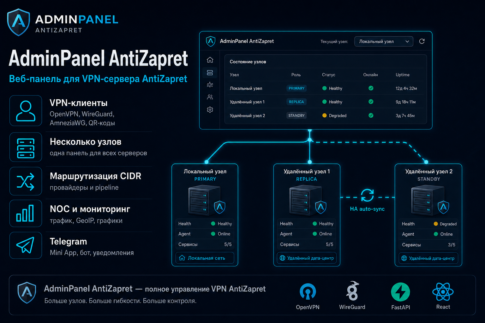
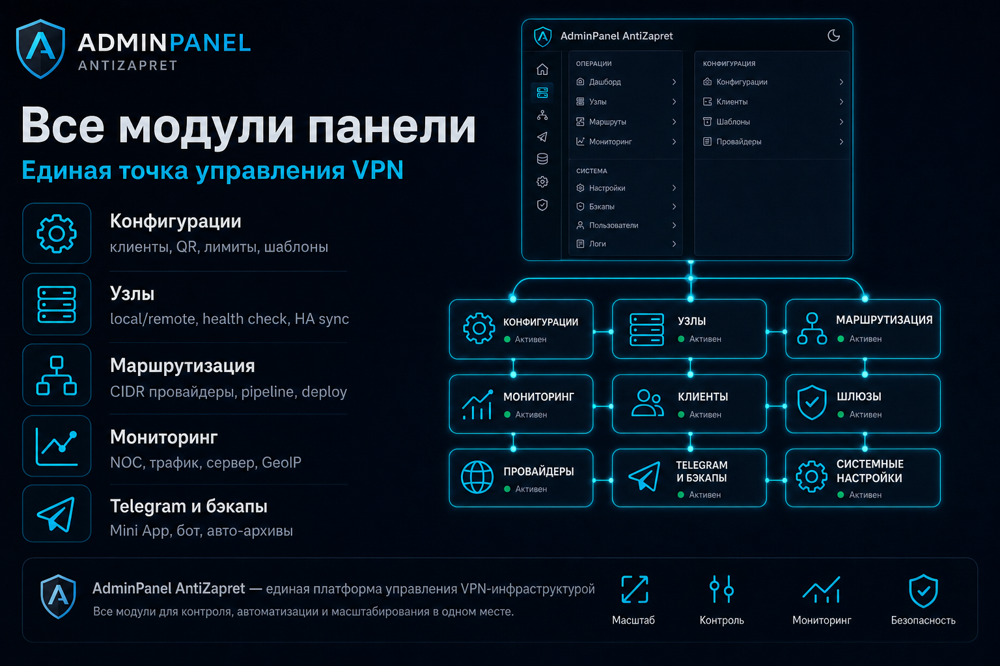
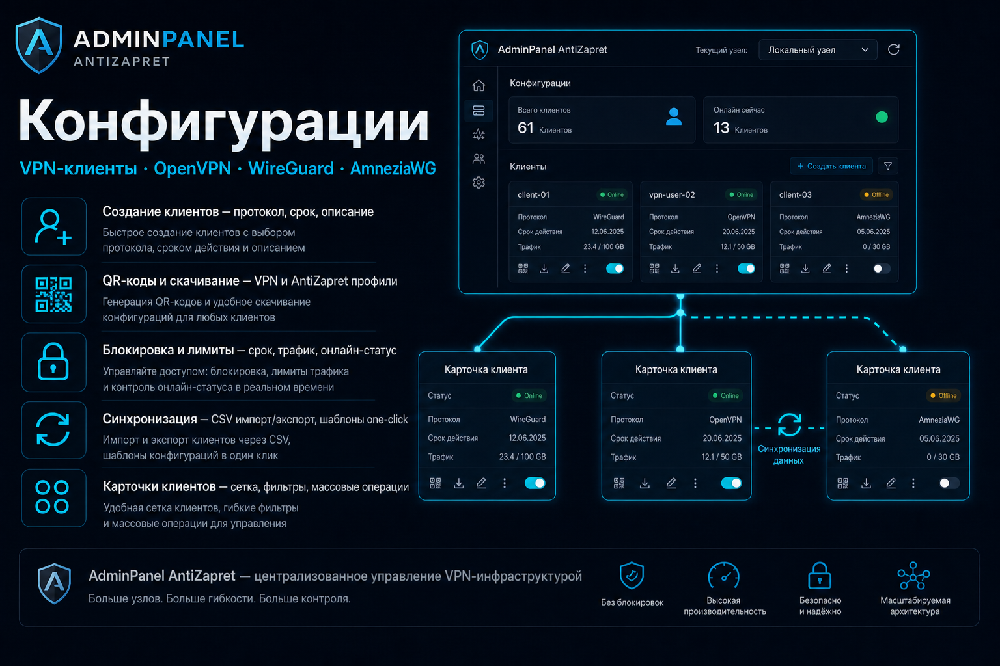
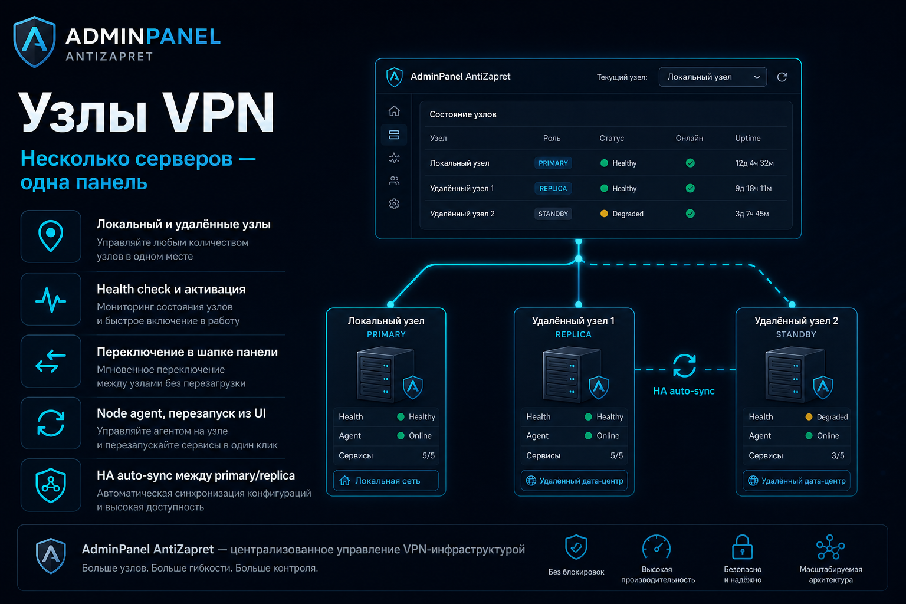
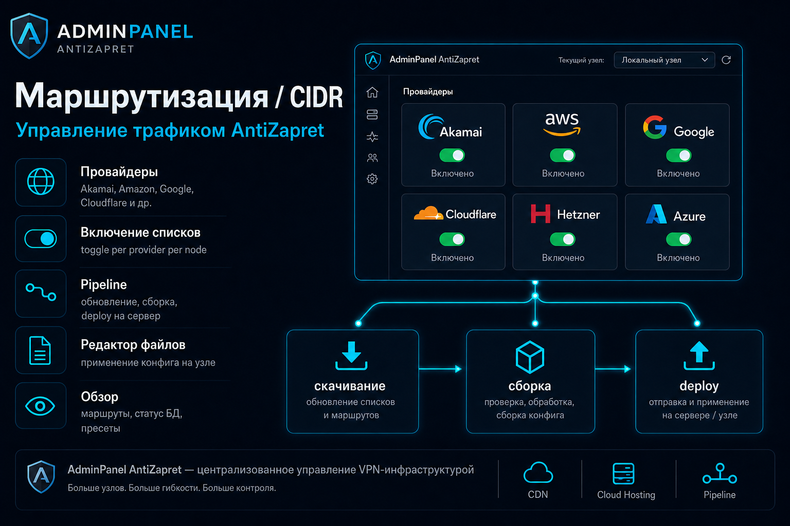
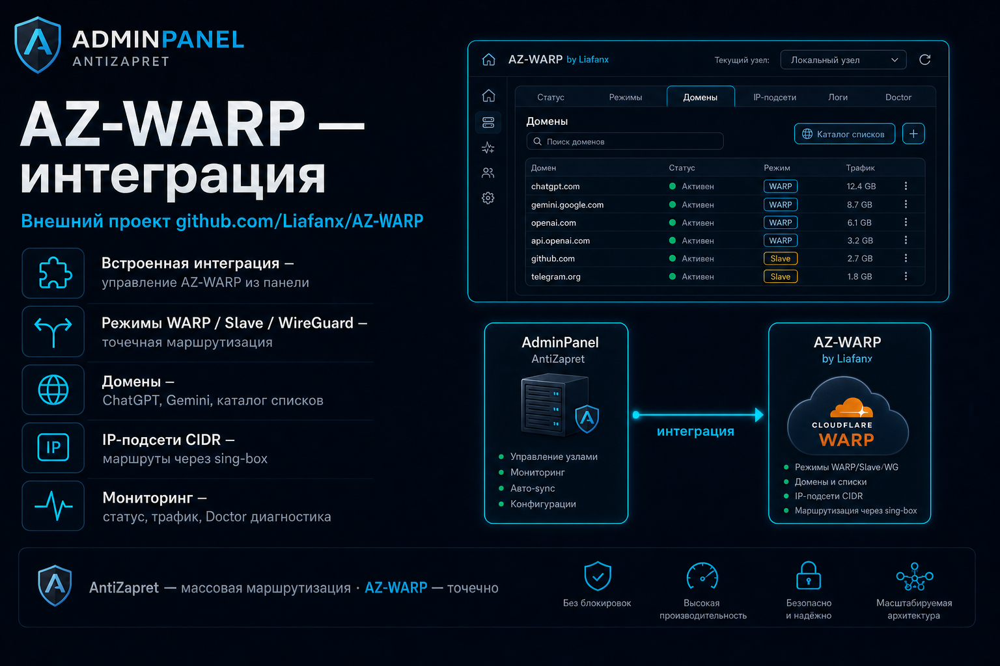
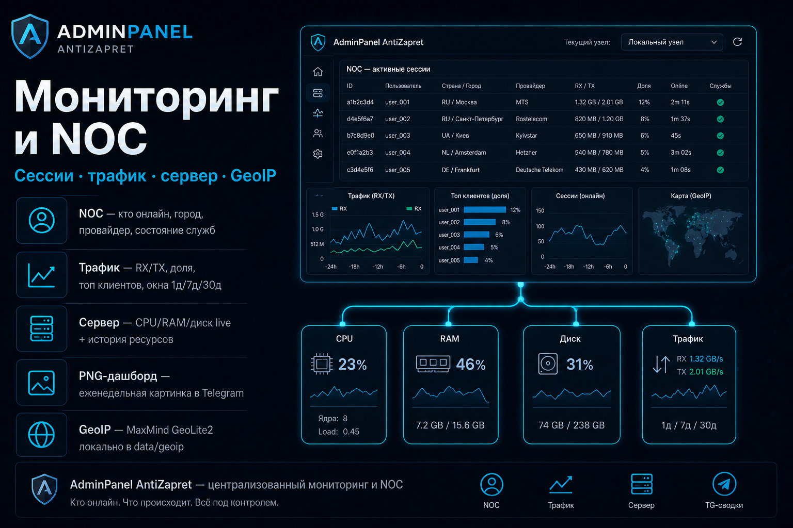
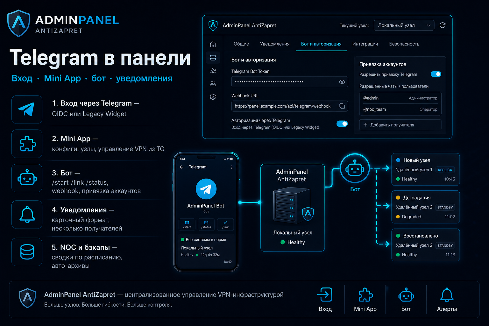
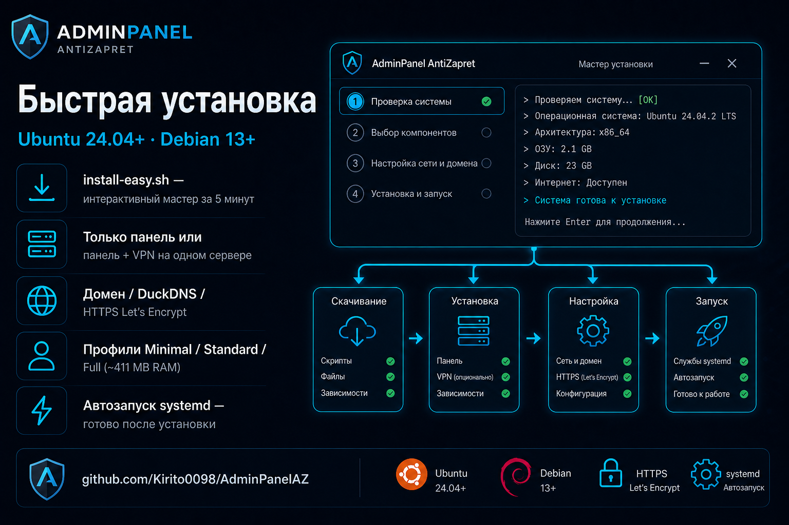
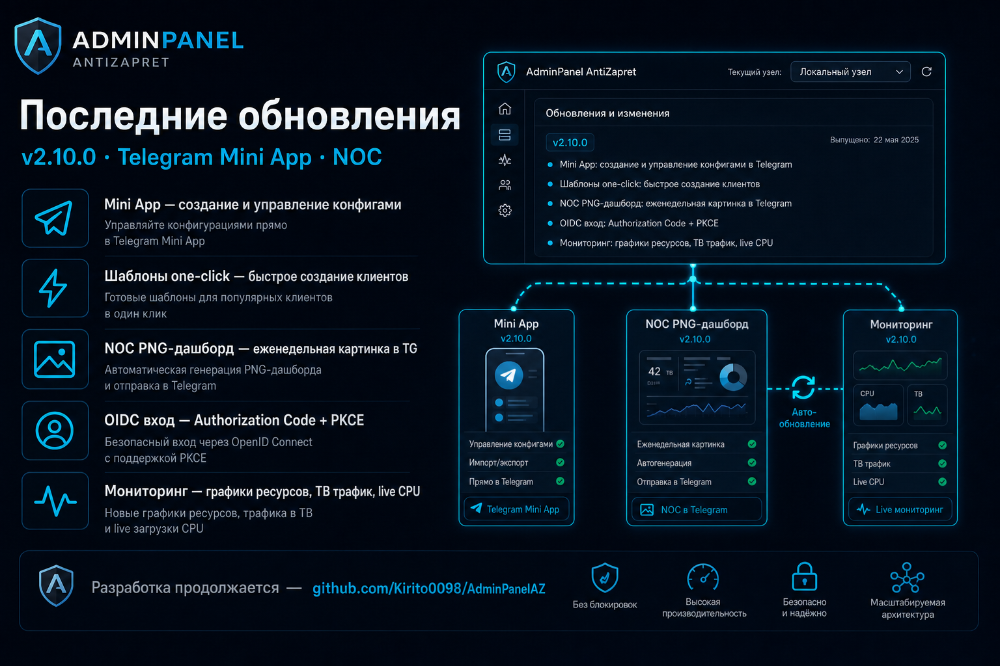

# 🛡️ AdminPanel AntiZapret

Веб-панель для администрирования VPN-сервера [AntiZapret](https://github.com/GubernievS/AntiZapret-VPN)

[](https://github.com/Kirito0098/AdminPanelAZ)
[](CHANGELOG.md)
[](CHANGELOG.md)
[](backend/)
[](frontend/)

[🚀 Быстрый старт](#-быстрый-старт) · [✨ Возможности](#-возможности) · [🖼️ Обзор](#-обзор-панели) ·
[📖 Руководства](docs/README.md) · [💬 Пожелания и баги](https://claymore0098.fider.io/) · [🔐 Безопасность](SECURITY.md) · [📝 Changelog](CHANGELOG.md)

<p align="center">
  
</p>

> [!NOTE]
> **Статус проекта**
> Проект **полностью перенесён** на новый стек: добавлен новый функционал, интерфейс и документация обновлены.
> Разработка **продолжается** — планируются новые возможности и улучшения.
> Предыдущая версия на Flask — [AdminAntizapret](https://github.com/Kirito0098/AdminAntizapret).

**Панель помогает администрировать VPN: клиенты, маршрутизация, мониторинг, бэкапы и Telegram.**

- **Пользователи и администраторы** — **[docs/README.md](docs/README.md)** — простые инструкции по каждому разделу
- **Разработчики** — [SECURITY.md](SECURITY.md) · [CHANGELOG.md](CHANGELOG.md) · [docs/PROJECT_MAP.md](docs/PROJECT_MAP.md) · [HA / Node Sync](docs/NodeSync.md)

## 🚀 Быстрый старт

**Требования:** Ubuntu 24.04+ или Debian 13+, root / sudo, доступ в интернет.
AntiZapret ставится **отдельно** на VPN-сервер — см. [AntiZapret-VPN](https://github.com/GubernievS/AntiZapret-VPN).

### Порты

| Порт | Назначение | Куда открывать |
| --- | --- | --- |
| **443** | HTTPS панели (Nginx) | в интернет — если заходите по домену |
| **80** | HTTP / проверка Let's Encrypt | в интернет — для выпуска HTTPS-сертификата |
| **8000** | Backend панели (uvicorn) | **только localhost** — снаружи не публикуется |
| **9100** | Node agent | localhost или между панелью и VPN-узлом |
| **6379** | Redis | localhost — если `UVICORN_WORKERS > 1` |

Порты **OpenVPN / WireGuard / AmneziaWG** задаёт **AntiZapret** на VPN-сервере, не панель.
При установке с доменом и HTTPS мастер может предложить настроить firewall (UFW) — открыть **80** и **443**.

> **Простая установка** — порты панели (**443**, **80**, **8000**, **9100**) мастер **выставляет автоматически**, вводить их не нужно.
> **Полный установщик** — те же порты можно **задать вручную** на шагах HTTPS, backend и node agent.
> Нестандартный HTTPS-порт также задаётся в `HTTPS_PUBLIC_PORT` в `backend/.env`.

### Варианты установки

Первый вопрос мастера — **что ставим на этот сервер**. Три сценария:

| Вариант | Что ставится | Когда выбирать |
| --- | --- | --- |
| **Только панель** | Веб-интерфейс управления | Отдельный **управляющий сервер**; к нему потом подключаются VPN-узлы (AntiZapret на других машинах) |
| **Панель + узел** | Панель и **локальный узел** на одном хосте | **AntiZapret уже установлен** на этом же сервере (`/root/antizapret`) — типичный случай «всё на одном VDS» |
| **Узел** | Только **node agent** (без панели) | Отдельный **VPN-сервер**, который нужно **подключить к уже работающей панели** на другом хосте |

#### 🟢 Простая установка — рекомендуется новичкам

Порты из таблицы выше назначаются **автоматически** — достаточно выбрать домен или локальный доступ.

```bash
sudo apt update && sudo apt install -y git wget curl
wget -qO /tmp/install-easy.sh https://raw.githubusercontent.com/Kirito0098/AdminPanelAZ/refs/heads/main/install-easy.sh
sudo bash /tmp/install-easy.sh
```

Мастер спросит:

1. **Что ставим** — [только панель, панель + узел, или узел](#варианты-установки) (см. таблицу выше)
2. **Как заходить в браузере** — свой домен, бесплатный DuckDNS, или только на этом сервере (только для вариантов с панелью)
3. **Логин и пароль** администратора
4. **Профиль ресурсов** — Minimal (1 GB, только панель без VPN на хосте) или Standard / Full
   (рекомендуется **1 GB+**; стек Full ≈ **411 MB** — см. [Production](#️-production-vds-redis-и-профили))
5. **Автозапуск** — включается автоматически (рекомендуется)

#### 🔵 Полный установщик — больше настроек

Порты можно **задать вручную** — публичный HTTPS, HTTP для Let's Encrypt, внутренний backend и node agent.

```bash
sudo apt update && sudo apt install -y git wget curl
wget -qO /tmp/install.sh https://raw.githubusercontent.com/Kirito0098/AdminPanelAZ/refs/heads/main/install.sh
sudo bash /tmp/install.sh
```

Мастер спросит:

1. **Тип** — [только панель, панель + узел, или узел](#варианты-установки)
2. **Домен или DDNS** — DuckDNS / No-IP / свой домен (для панели; на узле не спрашивается)
3. **HTTPS** — Let's Encrypt (рекомендуется) или самоподписанный сертификат; **порты 443 / 80** — вручную, если нужен нестандартный
4. **Backend и node agent** — порты **8000** и **9100** (по умолчанию те же, что в таблице)
5. **Логин и пароль** администратора
6. **Автозапуск** — для постоянной работы выберите systemd

Подробнее: [после установки](#-после-установки) · [DDNS](#-бесплатный-адрес-для-панели-ddns) · [Production](#️-production-vds-redis-и-профили)

## 📑 Содержание

- [🚀 Быстрый старт](#-быстрый-старт)
  - [Варианты установки](#варианты-установки)
- [🖼️ Обзор панели](#-обзор-панели)
- [✨ Возможности](#-возможности)
- [✅ После установки](#-после-установки)
- [📖 Руководства пользователя](#-руководства-пользователя)
- [🌐 Бесплатный адрес (DDNS)](#-бесплатный-адрес-для-панели-ddns)
- [🔗 StatusOpenVPN на одном домене](#-statusopenvpn-на-одном-домене)
- [⚙️ Production: VDS, Redis и профили](#️-production-vds-redis-и-профили)
- [🔐 Безопасность](#-безопасность)
- [💻 Полезные команды](#-полезные-команды-на-сервере)
- [📝 История изменений](#-история-изменений)
- [💖 Поддержка проекта](#-поддержка-проекта)

## 🖼️ Обзор панели

<p align="center">
  
</p>

| | | |
| --- | --- | --- |
| [](docs/konfiguracii.md) | [](docs/uzly.md) | [](docs/routing-cidr.md) |
| [](docs/warper.md) | [](docs/noc-monitoring.md) | [](docs/Telegram.md) |

## ✨ Возможности

### 🔌 VPN и клиенты

<p align="center">
  
</p>

- OpenVPN, WireGuard, AmneziaWG — создание, скачивание, QR-коды ([инструкция](docs/konfiguracii.md))
- Блокировка, срок действия, лимиты трафика
- Несколько VPN-серверов (узлов) из одной панели ([инструкция](docs/uzly.md))
- **HA (отказоустойчивость)** — группы синхронизации primary + replica, один домен, Push full, verify и авто-репликация с primary ([Node Sync](docs/NodeSync.md), UI: **Узлы → Группы синхронизации**)

<p align="center">
  
</p>

### 🧭 Маршрутизация

<p align="center">
  
</p>

- Списки провайдеров (CIDR), пресеты, конфиг AntiZapret ([маршрутизация](docs/routing-cidr.md), [конфиг](docs/antizapret-config.md))
- Редактор файлов AntiZapret с применением на сервер ([инструкция](docs/edit-files.md))
- AZ-WARP — точечная маршрутизация через Cloudflare WARP ([инструкция](docs/warper.md))

<p align="center">
  
</p>

### 📊 Мониторинг

<p align="center">
  
</p>

- **NOC** — кто подключён, откуда (город и провайдер), графики, состояние служб;
  **Telegram-сводки** — ежедневный/еженедельный текст и еженедельный PNG-дашборд
  ([инструкция](docs/noc-monitoring.md))
- **Трафик** — расход по клиентам и доля в общем объёме, лимиты, окна 1д / 7д / 30д ([инструкция](docs/traffic-monitoring.md))
- **Сервер** — live CPU/RAM/диск, **история ресурсов** за 1 / 7 / 30 дней, vnStat ([инструкция](docs/server-monitor.md))
- **Локальная GeoIP** — MaxMind GeoLite2 в `data/geoip/` ([инструкция](docs/GeoIP.md))

### 🔐 Безопасность и администрирование

- Роли: администратор, пользователь ([пользователи](docs/nastrojki/polzovateli.md))
- 2FA, белый список IP, защита от перебора паролей ([безопасность](docs/nastrojki/bezopasnost.md))
- Вход через Telegram — Legacy Login Widget или OpenID Connect ([Telegram](docs/Telegram.md))
- Бэкапы вручную и по расписанию, отправка в Telegram ([инструкция](docs/nastrojki/rezervnye-kopii.md))

### 💬 Telegram

<p align="center">
  
</p>

- **Вход в панель** — Legacy Login Widget или OpenID Connect (настройка на вкладке «Бот и авторизация»)
- **Mini App** — адаптированная панель и отправка VPN-конфигов из Telegram
- **Бот** — webhook, команды (`/start`, `/link`, `/status`, …), привязка и отвязка аккаунтов администратором
- **Уведомления** — несколько получателей (admin из «Пользователи» + chat ID групп/каналов),
  карточный формат, тест каждого события
- **NOC и бэкапы** — сводки по расписанию в Telegram, авто-отправка архивов выбранным получателям

Пошаговая настройка и вкладки раздела: [docs/Telegram.md](docs/Telegram.md)

## ✅ После установки

<p align="center">
  
</p>

1. Откройте URL из вывода установщика
2. Войдите под созданным администратором
3. **Смените пароль** и включите **2FA** — [Настройки → Профиль](docs/nastrojki/profil.md)
4. Если VPN на другом сервере — добавьте узел — [Узлы](docs/uzly.md)
5. На **Конфигурации** нажмите **Синхронизировать** — [инструкция](docs/konfiguracii.md)
6. Опционально: настройте **Telegram** (бот, вход, уведомления) — [инструкция](docs/Telegram.md)
7. Для **HA** (два сервера на один домен): создайте группу синхронизации на **Узлах**, выполните **Настройку** (домен → Push full → verify) — [Node Sync](docs/NodeSync.md). После обновления панели перезапустите **node agent** на VPN-узлах (`systemctl restart adminpanelaz-node`), чтобы в «Узлах» отображалась версия **1.5.0**

> [!NOTE]
> **Вход по умолчанию** (если не задавали в мастере): `admin` / `admin` — смените сразу.

### 🗑️ Удаление и переустановка

```bash
sudo ./install.sh              # меню: переустановка или удаление
sudo ./install.sh --uninstall  # удалить сервисы панели
```

AntiZapret и VPN-конфиги при удалении панели **не трогаются**.

## 📖 Руководства пользователя

Полный список инструкций: **[docs/README.md](docs/README.md)**

- **VPN-клиенты** — [docs/konfiguracii.md](docs/konfiguracii.md)
- **Несколько серверов и HA** — [docs/uzly.md](docs/uzly.md) · [docs/NodeSync.md](docs/NodeSync.md)
- **NOC и трафик** — [docs/noc-monitoring.md](docs/noc-monitoring.md) · [docs/traffic-monitoring.md](docs/traffic-monitoring.md)
- **Настройки и бэкапы** — [docs/nastrojki/README.md](docs/nastrojki/README.md)
- **Адрес сайта, HTTPS, StatusOpenVPN** — [docs/nastrojki/set-i-publikaciya.md](docs/nastrojki/set-i-publikaciya.md)
- **Telegram** — [docs/Telegram.md](docs/Telegram.md)

## 🌐 Бесплатный адрес для панели (DDNS)

Если нет своего домена, в мастере установки можно выбрать:

- [DuckDNS](https://www.duckdns.org) — `myvpn.duckdns.org`
- [No-IP](https://www.noip.com) — `myvpn.ddns.net`

> [!TIP]
> Для HTTPS нужны открытые порты **80** и **443** на сервере. Свой домен тоже подойдёт — укажите его в мастере на шаге HTTPS.

## 🔗 StatusOpenVPN на одном домене

[StatusOpenVPN](https://github.com/TheMurmabis/StatusOpenVPN) занимает `https://домен/status/`. Если оба поставят отдельный nginx-сайт на один домен — будет конфликт.

**Порядок:**

1. **StatusOpenVPN** — HTTPS на домене, проверьте `https://домен/status/`
2. **AdminPanelAZ** — полная установка (`install.sh`), на шаге публикации выберите **HTTP напрямую без TLS** (не Nginx и не простую установку «из интернета»)
3. Откройте панель по `http://IP:порт/` → **Настройки → Адрес сайта и HTTPS**
4. **Через Nginx** → **Let's Encrypt** → тот же домен → подпуть `panel` → включите **Интегрировать с StatusOpenVPN** → **Применить настройки**

**Итог:** `https://домен/status/` — Status · `https://домен/panel/` — панель

> [!WARNING]
> Подпуть обязателен. Не удаляйте Status через его `uninstall` после интеграции — может сломать nginx и доступ к панели.
> Если панель пропала — по SSH: `cd /opt/AdminPanelAZ && sudo ./scripts/nginx-repair.sh`

Подробно: [docs/nastrojki/set-i-publikaciya.md](docs/nastrojki/set-i-publikaciya.md#совместно-со-statusopenvpn-на-одном-домене)

## ⚙️ Production: VDS, Redis и профили

Профили (**Minimal / Standard / Full**) меняют **фоновые задачи панели** (collectors, CIDR scheduler).
В UI на вкладке **Модули** показывается замер **только стека AdminPanelAZ**: панель + локальная нода и её
VPN-сервисы (`ANTIZAPRET_PATH`). Сторонние проекты на том же VDS не входят в цифру.

**Замер на реальном сервере (профиль Full, панель + локальная нода):**

- **Текущий стек** — AdminPanelAZ **358 MB** + нода **53 MB** ≈ **411 MB**
- **Средний стек за 7 дней** — ~**148 MB**
- **Minimal / Standard** — меньше нагрузка на панель (без части collectors); VPN на хосте тот же

| Сценарий | Стек (замер / ориентир) | VDS RAM |
| --- | --- | --- |
| Только панель, профиль Minimal (VPN на других узлах) | без локальной ноды в замере | **1 GB** + swap |
| Панель + node agent + VPN на одном VDS, профиль Full | **~411 MB** (358 + 53); ср. ~148 MB | **1 GB+** (лучше **2 GB** с запасом под ОС и VPN) |
| Профиль Standard | между Minimal и Full | **1 GB+** |

Профили задаются в мастере или в UI: **Настройки → Модули → Профили ресурсов**. После смены — перезапустите
панель. Подробнее: [docs/nastrojki/moduli.md](docs/nastrojki/moduli.md).

- **Redis** — обязателен при `UVICORN_WORKERS > 1`: `AUTH_RATE_LIMIT_BACKEND=redis`,
  `API_RATE_LIMIT_BACKEND=redis`, `REDIS_URL`. См. [SECURITY.md](SECURITY.md)
- **Health** — `GET /api/health` (лёгкий), `GET /api/health/deep` (БД, CIDR, traffic lag)
- **Метрики** — `GET /metrics` — Prometheus (`traffic_collector_lag_seconds`, `node_health_*`)
- **Node agent** — версия **1.5.0** (минимум **≥ 1.3.0** для HA crypto-sync и verify; **≥ 1.5.0** для byte-copy `.ovpn` при Push full); отображается в **Узлы** → health узла

## 🔐 Безопасность

Перед выходом панели в интернет:

- HTTPS
- Смена пароля и **2FA**
- Белый список IP

- **Адрес сайта и HTTPS** — [docs/nastrojki/set-i-publikaciya.md](docs/nastrojki/set-i-publikaciya.md)
- **Профиль и 2FA** — [docs/nastrojki/profil.md](docs/nastrojki/profil.md)
- **Доступ к панели** — [docs/nastrojki/bezopasnost.md](docs/nastrojki/bezopasnost.md)
- **Технические детали** — [SECURITY.md](SECURITY.md)

## 💻 Полезные команды на сервере

```bash
cd /opt/AdminPanelAZ
sudo ./scripts/adminpanel-menu.sh   # меню: перезапуск, бэкап, обновление
sudo systemctl restart adminpanelaz # перезапуск панели (если установлен systemd)
sudo ./scripts/nginx-setup.sh       # сменить HTTPS после установки
sudo ./scripts/nginx-repair.sh      # восстановить nginx (например после uninstall StatusOpenVPN)
```

## 📝 История изменений

<p align="center">
  
</p>

**Текущая версия: панель 2.17.0 · node agent 1.5.0** (2026-07-15)

Последний релиз — **NOC Ops** (federated SSE, Mbps, инциденты, health, фильтры, история подключений, HA physical node), **TG-алерт offline узла с grace** и **self-service для роли Пользователь** (Telegram в профиле, упрощённый Mini App, ops-разделы только admin).

Полный список: **[CHANGELOG.md](CHANGELOG.md)** · runbook аудита HA: [reviews/HA-sync-remediation-plan.md](reviews/HA-sync-remediation-plan.md)

## 💬 Обратная связь

Пожелания, баги и идеи — на доске **[AdminPanelAZ на Fider](https://claymore0098.fider.io/)**.

Перед новой записью **поищите похожие** — если тема уже есть, проголосуйте за неё, а не создавайте дубликат. GitHub не нужен.

## 💖 Поддержка проекта

- Донат: [cloudtips.ru](https://pay.cloudtips.ru/p/3c6704ca)
- Приватная группа Telegram: [Приватная группа в Telegram](https://t.me/+XJwXHTmMvUk3NTli)
- Личные сообщения: [Личные сообщения](https://t.me/Claymore0098)

---

*Сделано с ❤️ для сообщества AntiZapret · [⭐ Star на GitHub](https://github.com/Kirito0098/AdminPanelAZ)*
