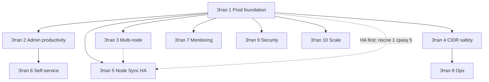
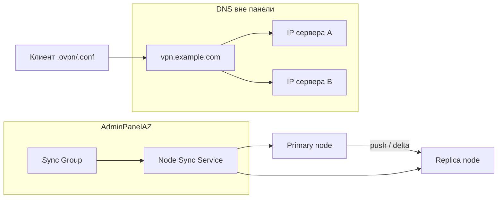

# Идеи развития AdminPanelAZ

> Личный backlog идей, отобранных для возможной реализации.  
> **План работ:** [10 этапов](#этапы-реализации-roadmap) · **Детали:** §1–§11 · **Приоритеты:** P0–P3

### Легенда: приоритет

| Метка | Когда делать | Смысл |
|-------|--------------|-------|
| **P0** | Сейчас / следующий спринт | Быстрый win, prod-критично или почти готово в коде |
| **P1** | 1–2 месяца | Высокая ценность для админов и пользователей; разумные усилия |
| **P2** | Backlog | Полезно, но не блокирует; можно отложить |
| **P3** | Когда понадобится | Nice-to-have, enterprise или при росте масштаба |

**Как читать оценку:** приоритет = *ценность ÷ (сложность + риск)*, а не «важность в вакууме». PostgreSQL важен, но P3 — пока SQLite не упирается в потолок.

### Легенда: производительность

| Метка | Значение |
|-------|----------|
| 🟢 **Минимальное** | Практически не влияет на нагрузку или снижает её |
| 🟡 **Низкое** | Небольшой overhead; управляемо настройками |
| 🟠 **Среднее** | Заметная нагрузка при активном использовании; нужны лимиты |
| 🔴 **Высокое** | Существенный рост ресурсов; архитектурные решения |

### Легенда: статус реализации

> **Актуализация:** 2026-06-16 — сверка с кодовой базой `/opt/AdminPanelAZ`.

| Метка | Значение |
|-------|----------|
| ✅ | **Реализовано** — функция в коде, есть тесты и/или UI; DoD этапа закрыт |
| ◐ | **Частично** — базовая реализация есть; не весь DoD, опциональная часть или нужна ручная настройка (MMDB, Redis…) |
| ⬜ | **Не начато** — в коде нет или только заготовки |

### Навигация по документу

| Часть | Содержание |
|-------|------------|
| [Этапы реализации](#этапы-реализации-roadmap) | **Главный план** — порядок работ, DoD, чеклисты |
| [Prompty-etapy.md](Etapy-prompty.md) | **Промпты и режимы Cursor** для каждого этапа |
| [Backlog-otkryto.md](Backlog-otkryto.md) | **Открытый backlog** — ◐ частично и ⬜ не начато |
| [§1–§11](#1-доработать-то-что-уже-частично-есть) | Каталог идей + [§11 VDS и размещение](#11-vds-и-размещение) |
| [Матрица приоритетов](#матрица-все-идеи-по-приоритету) | Сводная таблица P0–P3 |

---

## Этапы реализации (roadmap)

10 этапов в рекомендуемом порядке. Каждый этап можно выпускать отдельным релизом.  
**Зависимости:** не начинай этап N, пока не закрыт критичный минимум этапа N−1 (отмечено в колонке «Требует»).

> **Альтернативный трек «HA first»:** если уже используешь 2 IP на один домен AntiZapret — после **Этапа 1** сразу **Этап 5** (Node Sync MVP), затем вернуться к этапам 2–4.

### Сводка этапов

| Этап | Название | Срок* | Perf | Статус |
|------|----------|-------|------|--------|
| **1** | Prod foundation | 1–2 нед. | 🟢 | ✅ |
| **2** | Admin productivity | 2–4 нед. | 🟠 | ✅ |
| **3** | Multi-node обзор | 2–3 нед. | 🟠 | ✅ |
| **4** | CIDR безопасность | 2–3 нед. | 🟡 | ✅ |
| **5** | Node Sync / HA | 3–5 нед. | 🟠 | ✅ |
| **6** | Self-service | 2–4 нед. | 🟡 | ✅ |
| **7** | Мониторинг и алерты | 2–3 нед. | 🟡 | ✅ |
| **8** | Ops и интеграции | по мере нужды | 🟡 | ✅ |
| **9** | Security / enterprise | перед публичным prod | 🟢 | ✅ |
| **10** | Масштаб | при росте нагрузки | 🟡→🟢 | ◐ |

*\*Ориентир для одного разработчика; параллельте задачи внутри этапа, где нет зависимости.*

---

### Этап 1 — Prod foundation

**Цель:** панель стабильно живёт в prod — видимость, health, БД не раздувается, CI надёжен.

**Требует:** — (стартовый этап)

| # | Задача | § | P | Perf | Статус |
|---|--------|---|---|------|--------|
| 1.1 | Retention policies (traffic samples, action logs) | §5 | P0 | 🟢+ | ✅ |
| 1.2 | Prometheus `/metrics` | §2 | P0 | 🟢 | ✅ |
| 1.3 | Redis в prod (док + дефолт в install для workers>1) | §2 | P0 | 🟢 | ✅ |
| 1.4 | Расширенный health (`/health` + `/health/deep`) | §2 | P0 | 🟡 | ✅ |
| 1.5 | Route budget dashboard | §8 | P0 | 🟢 | ✅ |
| 1.6 | Корреляция NOC → Traffic (клик из online-списка) | §5 | P0 | 🟢 | ✅ |
| 1.7 | Frontend unit tests (Vitest baseline) | §9 | P0 | 🟢 | ✅ |
| 1.8 | **Resource profiles** (Minimal / Standard / Full) | §2, §11 | P0 | 🟢+ | ✅ |

**DoD (критерий готовности):**
- [x] Grafana или ручной scrape `/metrics` показывает lag collectors
- [x] systemd/install.sh использует deep health
- [x] Retention настраивается в UI или `.env`
- [x] Vitest в CI green
- [x] Профиль **Minimal** отключает лишние workers; панель на 1 GB (panel-only) стабильна

---

### Этап 2 — Admin productivity

**Цель:** админ тратит меньше времени на рутину с клиентами.

**Требует:** Этап 1 (background_tasks и метрики — для mass ops)

| # | Задача | § | P | Perf | Статус |
|---|--------|---|---|------|--------|
| 2.1 | Группы / теги клиентов | §3 | P1 | 🟢 | ✅ |
| 2.2 | Шаблоны клиентов | §3 | P1 | 🟢 | ✅ |
| 2.3 | Массовые операции (block / delete / renew по тегу) | §1 | P1 | 🟠 | ✅ |
| 2.4 | Отдельная вкладка AmneziaWG | §3 | P1 | 🟢 | ✅ |
| 2.5 | Управление активными сессиями | §1 | P1 | 🟢 | ✅ |

**DoD:**
- [x] Массовое действие на 20+ клиентов — фоновая задача + progress
- [x] Фильтр по тегу на Dashboard и в mass ops
- [x] Экран сессий с revoke

**Порядок внутри этапа:** 2.1 → 2.2 → 2.3 → 2.4, 2.5 параллельно

---

### Этап 3 — Multi-node обзор

**Цель:** несколько VPN-серверов видны с одного экрана (регионы, не HA).

**Требует:** Этап 1 (кэш метрик); желательно Этап 2 (теги для фильтрации)

| # | Задача | § | P | Perf | Статус |
|---|--------|---|---|------|--------|
| 3.1 | Global dashboard (сводка всех узлов) | §4 | P1 | 🟠 | ✅ |
| 3.2 | Сравнение узлов side-by-side | §4 | P2 | 🟠 | ✅ |
| 3.3 | Geo-routing hint (подсказка «ближе node Y») | §4 | P2 | 🟡 | ✅ |
| 3.4 | Политики per-node (лимиты EU vs RU) | §4 | P2 | 🟢 | ✅ |

**DoD:**
- [x] Главная или отдельная страница: online/t health по всем узлам без switch active node
- [x] Кэш 30–60 с, без N× запросов с фронта на каждый refresh

**Порядок:** 3.1 обязательно → 3.2 → 3.3, 3.4 опционально

---

### Этап 4 — CIDR безопасность

**Цель:** deploy маршрутов предсказуемый, откат без SSH.

**Требует:** Этап 1 (route budget — уже в 1.5)

| # | Задача | § | P | Perf | Статус |
|---|--------|---|---|------|--------|
| 4.1 | Dry-run diff перед deploy | §8 | P1 | 🟡 | ✅ |
| 4.2 | Rollback CIDR deploy (`runtime_backups`) | §8 | P1 | 🟠 | ✅ |
| 4.3 | Custom provider wizard | §8 | P2 | 🟡 | ✅ |

**DoD:**
- [x] Перед deploy — preview файлов и числа маршрутов
- [x] One-click rollback с подтверждением
- [x] Action log + AdminNotify при failed deploy

---

### Этап 5 — Node Sync / HA (AntiZapret failover)

**Цель:** два сервера, один домен, два IP — ключи синхронны без ручного `client.sh 8`.

**Требует:** Этап 1 (background_tasks); Этап 3 желателен (UI узлов)

| # | Задача | § | P | Perf | Статус |
|---|--------|---|---|------|--------|
| 5.1 | Sync Group — модель + UI на «Узлы» | §10 | P1 | 🟢 | ✅ |
| 5.2 | Manual full push (backup primary → restore replica) | §10 | P1 | 🟠 | ✅ |
| 5.3 | Verify parity (списки клиентов + checksums) | §10 | P1 | 🟡 | ✅ |
| 5.4 | Auto-sync при create/delete клиента | §10 | P2 | 🟡 | ✅ |
| 5.5 | Reconcile worker (split-brain) | §10 | P2 | 🟢–🟡 | ✅ |
| 5.6 | HA в Dashboard и NOC (одна карточка на группу) | §10 | P2 | 🟢 | ✅ |

**DoD MVP (5.1–5.3):**
- [x] Создана HA-группа с shared domain
- [x] Full push завершается с progress bar
- [x] Verify показывает «ready for DNS failover» или diff
- [x] Документировано: DNS (2-й IP) — вручную у регистратора

**DoD v2 (5.4–5.6):**
- [x] Create client на primary → автоматически на replica
- [x] Reconcile алертит при расхождении >15 мин
- [x] NOC: агрегация online по HA-группе (Dashboard badge, dedup configs, federated NOC по sync group)

**Порядок:** строго 5.1 → 5.2 → 5.3 → (DNS) → 5.4 → 5.5 → 5.6

---

### Этап 6 — Self-service

**Цель:** role=user обслуживает себя; admin реже вмешивается.

**Требует:** Этап 2 (шаблоны, квоты); Telegram включён

| # | Задача | § | P | Perf | Статус |
|---|--------|---|---|------|--------|
| 6.1 | Self-service для user-роли (create/download/traffic в лимитах) | §3 | P1 | 🟡 | ✅ |
| 6.2 | TG user commands (`/myconfigs`, `/traffic`) | §7 | P1 | 🟡 | ✅ |
| 6.3 | Авто-напоминания (expiry, лимит, temp block) | §3 | P1 | 🟡 | ✅ |

**DoD:**
- [x] Квоты: N конфигов на user, rate limit на create
- [x] Mini App и веб согласованы по правам
- [x] Напоминание не чаще 1 раза в сутки на событие

---

### Этап 7 — Мониторинг и алерты

**Цель:** NOC не зависит от внешних API; проактивные уведомления.

**Требует:** Этап 1 (Prometheus — для правил); AdminNotify

| # | Задача | § | P | Perf | Статус |
|---|--------|---|---|------|--------|
| 7.1 | Локальная GeoIP БД | §5 | P1 | 🟡 | ✅ |
| 7.2 | Scheduled reports в TG | §7 | P1 | 🟡 | ✅ |
| 7.3 | Правила алертов (кастомные пороги) | §5 | P2 | 🟡 | ✅ |
| 7.4 | Отчёты PDF/TG (weekly) | §5 | P2 | 🟡 | ✅ |

**DoD:**
- [x] NOC работает при недоступности ip-api.com — при загруженных MMDB (`data/geoip/*.mmdb`); onboarding в README + UI статус
- [x] Ежедневная/еженедельная сводка в TG admin
- [x] Кастомные правила алертов (7.3)
- [x] PDF weekly reports (7.4)

---

### Этап 8 — Ops и интеграции

**Цель:** меньше SSH; автоматизация и миграции.

**Требует:** Этапы 1–4 стабильны

| # | Задача | § | P | Perf | Статус |
|---|--------|---|---|------|--------|
| 8.1 | Runbook в UI (site-diagnostics) | §2 | P2 | 🟢 | ✅ |
| 8.2 | Import / export CSV | §3 | P2 | 🟠 | ✅ |
| 8.3 | Rolling update узлов | §4 | P2 | 🟠 | ✅ |
| 8.4 | OpenAPI `/docs` с auth-gate | §9 | P2 | 🟢 | ✅ |
| 8.5 | Event webhooks | §9 | P2 | 🟡 | ✅ |
| 8.6 | Mini App warper/CIDR read-only | §7 | P2 | 🟢 | ✅ |

**DoD:**
- [x] Import 100+ клиентов — только background task
- [x] Webhook retry queue при 5xx endpoint

---

### Этап 9 — Security / enterprise

**Цель:** публичный или корпоративный деплой.

**Требует:** Этап 1; перед выходом в интернет

| # | Задача | § | P | Perf | Статус |
|---|--------|---|---|------|--------|
| 9.1 | CSP hardening (nonce) | §6 | P2 | 🟢 | ✅ |
| 9.2 | WebAuthn / passkeys | §6 | P2 | 🟢 | ✅ |
| 9.3 | Audit export + SIEM | §6 | P2 | 🟡 | ✅ |
| 9.4 | Secrets rotation UI | §6 | P3 | 🟢 | ✅ |

**DoD:**
- [x] CSP без `'unsafe-inline'` на основных страницах — nonce для scripts; style-src hardened
- [x] Passkeys для admin optional alongside TOTP
- [x] Secrets rotation wizard UI (9.4)

---

### Этап 10 — Масштаб и экосистема

**Цель:** рост нагрузки, i18n, расширяемость.

**Требует:** метрики из Этапа 1 показывают упор в SQLite / нужен i18n

| # | Задача | § | P | Perf | Статус |
|---|--------|---|---|------|--------|
| 10.1 | PostgreSQL вместо SQLite | §2 | P3 | 🟡→🟢 | ⬜ |
| 10.2 | Полноценный i18n (RU + EN) | §1 | P3 | 🟢 | ◐ |
| 10.3 | Plugin / hook architecture | §9 | P3 | 🟡 | ✅ |
| 10.4 | Inline-режим бота | §7 | P3 | 🟡 | ✅ |

**DoD:**
- [ ] Миграция SQLite → PG документирована, dual-support или one-way
- [~] EN locale для web + bot — словарь бота (`telegram_bot_i18n.py`) ✅; веб-панель без react-i18next
- [x] Plugin hooks registry (10.3)
- [x] Inline bot (10.4)

---

### Диаграмма зависимостей этапов

---

### Быстрый выбор трека

| Если твой случай | Начни с | Затем |
|------------------|---------|-------|
| Один сервер, мало клиентов | Этап 1 → 2 → 4 | 6, 7 |
| Несколько регионов (EU+US) | Этап 1 → 3 → 2 | 4, 6 |
| **2 IP, один домен AntiZapret** | Этап 1 → **5 (MVP)** → 4 | 2, 3 |
| **Много VDS 1/1, панель отдельно** | Этап 1 (**1.8 Minimal**) → 2 | 4, VPN на 1 GB |
| Готовишь публичный prod | Этап 1 → 9 | 2, 6 |
| SQLite «database is locked» | Этап 1 → **10.1** | остальное |

---

## Справочник: приоритеты P0–P3

Краткий список по приоритету (клик — развернуть)

### P0 — ближайшие шаги

| # | Идея | Этап |
|---|------|------|
| 1 | Retention policies | 1 |
| 2 | Prometheus `/metrics` | 1 |
| 3 | Redis в prod | 1 |
| 4 | Расширенный health | 1 |
| 5 | Route budget dashboard | 1 |
| 6 | Корреляция NOC + Traffic | 1 |
| 7 | Frontend unit tests | 1 |
| 8 | Resource profiles (Minimal) | 1 |

### P1 — основной backlog

Массовые операции (2) · Global dashboard (3) · Node Sync MVP (5) · Управление сессиями (2) · Self-service (6) · TG user commands (6) · Dry-run + Rollback CIDR (4) · Локальная GeoIP (7) · Авто-напоминания (6) · Группы/теги (2) · Шаблоны (2) · Scheduled reports TG (7) · AmneziaWG (2)

### P2 — backlog

Runbook (8) · Import CSV (8) · Сравнение узлов (3) · HA auto-sync (5) · … — см. [матрицу](#матрица-все-идеи-по-приоритету)

### P3 — по мере роста

PostgreSQL (10) · i18n (10) — см. [матрицу](#матрица-все-идеи-по-приоритету); inline bot, plugin, secrets rotation — ✅

---

## 1. Доработать то, что уже частично есть

Идеи с наименьшим порогом входа: часть инфраструктуры уже в кодовой базе.

---

### Массовые операции с клиентами · **P1**

| | |
|---|---|
| **Приоритет** | **P1** — одна из главных болей админа при >30 клиентах |
| **Сложность** | Средняя |
| **Perf** | 🟠 |

**Что даст:** админ выделит группу конфигов и одним действием заблокирует, продлит срок, удалит или сменит владельца. Меньше рутины и ошибок «по одному клику».

**Производительность:** пиковая нагрузка при массовых операциях (N запросов к node agent). Нужны `background_tasks`, батчинг и лимит параллелизма.

- [x] ✅ **Реализовано** — `bulk_config_ops.py`, `POST /api/configs/bulk`, фильтр по тегам

---

### Управление активными сессиями · **P1**

| | |
|---|---|
| **Приоритет** | **P1** — модель и heartbeat уже есть, не хватает UI |
| **Сложность** | Низкая |
| **Perf** | 🟢 |

**Что даст:** экран «Где я залогинен» — `ActiveWebSession`, IP, user-agent; принудительный logout с чужих устройств.

**Производительность:** чтение небольшой таблицы; фоновая очистка stale-сессий раз в N минут.

- [x] ✅ **Реализовано** — `SecurityTab`, `GET/DELETE /api/security/active-sessions`

---

### Полноценный i18n · **P3**

| | |
|---|---|
| **Приоритет** | **P3** — аудитория сейчас RU; большой объём перевода |
| **Сложность** | Высокая |
| **Perf** | 🟢 |

**Что даст:** EN и другие языки для веб-панели и бота; проще community и документация.

**Производительность:** +10–30 KB gzip на локаль; runtime без заметного CPU.

- [~] ◐ **Частично** — словарь Telegram-бота; веб без react-i18next

---

## 2. Операции и надёжность (production)

---

### Prometheus `/metrics` · **P0**

| | |
|---|---|
| **Приоритет** | **P0** — дёшево, сразу для Grafana/алертов |
| **Сложность** | Низкая |
| **Perf** | 🟢 |

**Что даст:** lag traffic collector, статус узлов, CIDR pipeline, rate limit hits — стандарт ops.

**Производительность:** scrape 15–60 с. Без high-cardinality labels (имена клиентов).

- [x] ✅ **Реализовано** — `GET /metrics`, `prometheus_metrics.py`, `test_metrics.py`

---

### Расширенный health · **P0**

| | |
|---|---|
| **Приоритет** | **P0** — install.sh уже проверяет `/api/health` |
| **Сложность** | Низкая |
| **Perf** | 🟡 |

**Что даст:** различать «процесс жив» и «БД/узел/CIDR сломаны»; проще runbook.

**Производительность:** лёгкий `/health` + тяжёлый `/health/deep` реже.

- [x] ✅ **Реализовано** — `/api/health`, `/api/health/deep`, install.sh deep check

---

### PostgreSQL вместо SQLite · **P3**

| | |
|---|---|
| **Приоритет** | **P3** — нужен при росте записи или HA; пока SQLite + WAL достаточно |
| **Сложность** | Высокая |
| **Perf** | 🟡→🟢 |

**Что даст:** несколько инстансов панели, конкурентная запись samples, нет «database is locked».

**Производительность:** на малых инсталляциях overhead выше SQLite; выигрыш при высокой write-нагрузке.

- [ ] ⬜ **Не начато**

---

### Redis по умолчанию в prod · **P0**

| | |
|---|---|
| **Приоритет** | **P0** — без Redis multi-worker ломает rate limit |
| **Сложность** | Низкая (конфиг + документация) |
| **Perf** | 🟢 |

**Что даст:** единый rate limit и auth counter при нескольких uvicorn workers.

**Производительность:** ~1 ms RTT на проверку; надёжнее in-memory.

- [x] ✅ **Реализовано** — README, SECURITY.md, install-wizard при workers>1

---

### Runbook в UI · **P2**

| | |
|---|---|
| **Приоритет** | **P2** — CLI `site-diagnostics` уже есть |
| **Сложность** | Средняя |
| **Perf** | 🟢 |

**Что даст:** guided diagnostics в панели для не-ops админов.

**Производительность:** по кнопке; отдельные шаги эпизодически 🟡.

- [x] ✅ **Реализовано** — `RunbookTab`, `site_diagnostics` API

---

### Resource profiles — экономия RAM/CPU/disk · **P0** · Этап 1.8

| | |
|---|---|
| **Приоритет** | **P0** — критично для VDS **1 GB** (panel-only) |
| **Сложность** | Средняя |
| **Perf** | 🟢 **+** |

**Что даст:** пресеты **Minimal / Standard / Full** — один клик отключает тяжёлый функционал; пользователь на слабом VDS понимает, что именно экономится. Опора на существующий `FeatureToggleService` + доработка `lifespan` в `main.py`.

**Реализовано (2026-06):**
- `feature_toggles.py` — `background` / `app_module`, `resource_impact_level`, `resource_savings`
- UI: **Настройки → Feature toggles** (`FeatureTogglesTab`)
- Workers частично читают `.env` (`TRAFFIC_SYNC_ENABLED`, `RESOURCE_METRICS_ENABLED`…)

**Ключевые файлы:** `feature_toggles.py`, `FeatureTogglesTab`, `lifespan_workers.py`, `scripts/install-wizard.sh`, `scripts/apply-resource-profile.py`

**Профиль Minimal (ориентир для 1 GB panel-only):**

| Включено | Выключено |
|----------|-----------|
| Dashboard, configs, nodes, settings, auth | traffic_sync, resource_metrics, panel metrics |
| 1 worker uvicorn | CIDR auto-scheduler, server_monitor UI |
| SQLite, retention | Telegram bot webhook, warper, routing UI (если не нужны) |
| health active node only / реже | опрос всех узлов каждые 60 с |

**Ожидаемый эффект (честно):**

| Ресурс | Minimal vs Full |
|--------|-----------------|
| **RAM steady** | −0…80 MB (не −500 MB) |
| **CPU / disk** | заметно меньше (нет traffic/CIDR/metrics write) |
| **Combo panel+VPN на 1 GB** | **не спасает** — VPN ~0.5+ GB сам по себе |

**DoD:**
- [x] POST `/api/feature-toggles/apply-profile?profile=minimal` (или аналог)
- [x] После apply + restart — в `ps`/metrics нет лишних collector loops
- [x] Документация: panel на 1 GB **без AntiZapret на том же хосте**

- [x] ✅ **Реализовано** — пресеты, `worker_lifecycle.py`, install-wizard, `test_feature_profiles.py`

---

## 3. VPN и клиенты (продуктовая ценность)

### Self-service для user-роли · **P1**

| | |
|---|---|
| **Приоритет** | **P1** — сильная связка с Mini App; разгрузка admin |
| **Сложность** | Средняя |
| **Perf** | 🟡 |

**Что даст:** user сам создаёт конфиги в лимитах, качает профили, смотрит трафик.

**Производительность:** квоты и rate limit на create обязательны.

- [x] ✅ **Реализовано** — `self_service.py`, квоты, guards

---

### Группы / теги клиентов · **P1**

| | |
|---|---|
| **Приоритет** | **P1** — усиливает массовые операции (P1) |
| **Сложность** | Низкая–средняя |
| **Perf** | 🟢 |

**Что даст:** фильтры на Dashboard, Traffic, массовые действия по тегу.

**Производительность:** индекс по тегу в БД.

- [x] ✅ **Реализовано** — `ConfigTag`, фильтр Dashboard

---

### Авто-напоминания · **P1**

| | |
|---|---|
| **Приоритет** | **P1** — AdminNotify + политики уже есть |
| **Сложность** | Средняя |
| **Perf** | 🟡 |

**Что даст:** TG за N дней до expiry cert, лимита трафика, temp block.

**Производительность:** worker раз в час; dedup «не слать дважды за сутки».

- [x] ✅ **Реализовано** — `user_reminder_worker`, dedup 24ч

---

### Шаблоны клиентов · **P1**

| | |
|---|---|
| **Приоритет** | **P1** — быстрый UX-win, мало backend |
| **Сложность** | Низкая |
| **Perf** | 🟢 |

**Что даст:** пресеты «OVPN 3650d + 100 GB» — создание в один клик.

**Производительность:** те же операции, что ручное создание.

- [x] ✅ **Реализовано** — `ClientTemplate`, API + Dashboard

---

### Import / export CSV · **P2**

| | |
|---|---|
| **Приоритет** | **P2** — нужен при миграции; не каждый день |
| **Сложность** | Средняя |
| **Perf** | 🟠 |

**Что даст:** миграция, массовое создание, аудит в Excel.

**Производительность:** фоновая задача + progress bar для 500+ строк.

- [x] ✅ **Реализовано** — `config_csv_ops.py`, background import

---

### Отдельная вкладка AmneziaWG · **P1**

| | |
|---|---|
| **Приоритет** | **P1** — toggle есть; UX-путаница реальна |
| **Сложность** | Низкая |
| **Perf** | 🟢 |

**Что даст:** разделение WG и AWG на Dashboard.

**Производительность:** только UI.

- [x] ✅ **Реализовано** — вкладка в `ConfigCardsSection`

---

## 4. Multi-node

---

### Global dashboard · **P1**

| | |
|---|---|
| **Приоритет** | **P1** — ключевое преимущество панели; `scope=all` уже в monitoring |
| **Сложность** | Средняя |
| **Perf** | 🟠 |

**Что даст:** сводка по всем узлам без переключения active node.

**Производительность:** кэш 30–60 с (`node_remote_cache`).

- [x] ✅ **Реализовано** — `GlobalDashboardSection`, federated cache

---

### Сравнение узлов · **P2**

| | |
|---|---|
| **Приоритет** | **P2** — логично после Global dashboard |
| **Сложность** | Средняя |
| **Perf** | 🟠 |

**Что даст:** side-by-side трафик, online, CIDR, CPU/RAM.

**Производительность:** один aggregate-endpoint на backend, не N×M с фронта.

- [x] ✅ **Реализовано** — `NodesCompareSection`, `/monitoring/nodes-compare`

---

### Политики per-node · **P2**

| | |
|---|---|
| **Приоритет** | **P2** — нужно мультирегиональным деплоям |
| **Сложность** | Средняя |
| **Perf** | 🟢 |

**Что даст:** разные лимиты и маршруты на EU vs RU node.

**Производительность:** данные уже scoped by `node_id`.

- [x] ✅ **Реализовано** — `NodePolicyWizard`, `NodePolicySummarySection`; per-node scope в БД + edit wizard лимитов EU/RU

---

### Rolling update узлов · **P2**

| | |
|---|---|
| **Приоритет** | **P2** — `node_update` по одному уже есть |
| **Сложность** | Средняя–высокая |
| **Perf** | 🟠 |

**Что даст:** очередь обновлений agent/AntiZapret с прогрессом и откатом.

**Производительность:** только фон; кратковременный offline узла.

- [x] ✅ **Реализовано** — `node_update_roll.py`

---

### Geo-routing hint · **P2**

| | |
|---|---|
| **Приоритет** | **P2** — nice UX; не меняет маршрутизацию |
| **Сложность** | Низкая |
| **Perf** | 🟡 |

**Что даст:** подсказка «ближе node Y» на базе `ip_geo.py`.

**Производительность:** lookup + кэш 24 ч.

- [x] ✅ **Реализовано** — `GeoRoutingHintBanner`, `/api/nodes/geo-routing-hint`

> **См. также:** [§10 Node Sync / HA-пары](#10-node-sync--ha-пары-antizapret-failover) — другой сценарий multi-node: не «EU + US», а **primary + replica** с одним доменом и двумя IP ([AntiZapret-VPN](https://github.com/GubernievS/AntiZapret-VPN)).

---

## 5. Мониторинг и аналитика

---

### Локальная GeoIP БД · **P1**

| | |
|---|---|
| **Приоритет** | **P1** — ip-api.com = rate limit и зависимость NOC |
| **Сложность** | Средняя |
| **Perf** | 🟡 |

**Что даст:** offline город/ISP; стабильность NOC.

**Производительность:** RAM ~50–100 MB; lookup быстрее HTTP.

- [x] ✅ **Реализовано** — `geoip_local.py`, README onboarding, UI статус «loaded / fallback ip-api» в Settings → Maintenance

---

### Правила алертов · **P2**

| | |
|---|---|
| **Приоритет** | **P2** — после Prometheus (P0) и AdminNotify |
| **Сложность** | Средняя |
| **Perf** | 🟡 |

**Что даст:** кастомные пороги: «>50 OVPN online», «узел offline >5 min».

**Производительность:** worker 1–5 мин по агрегатам.

- [x] ✅ **Реализовано** — `AlertRule`, alert worker, AdminNotify, UI Settings → Monitoring

---

### Отчёты · **P2**

| | |
|---|---|
| **Приоритет** | **P2** — дублирует часть Scheduled reports TG |
| **Сложность** | Средняя |
| **Perf** | 🟡 |

**Что даст:** weekly PDF/TG: top clients, инциденты, CIDR failures.

**Производительность:** генерация по расписанию, не в hot path.

- [x] ✅ **Реализовано** — weekly PDF/TG report, worker + опциональная доставка в TG; TG-сводки (7.2) отдельно

---

### Retention policies · **P0**

| | |
|---|---|
| **Приоритет** | **P0** — улучшает perf БД; мало кода |
| **Сложность** | Низкая |
| **Perf** | 🟢 **+** |

**Что даст:** авто-удаление samples и logs старше N дней.

**Производительность:** меньше данных → быстрее Traffic и Logs.

- [x] ✅ **Реализовано** — `retention_worker`, Settings → Maintenance

---

### Корреляция NOC + Traffic · **P0**

| | |
|---|---|
| **Приоритет** | **P0** — `/traffic?client=` уже есть; допилить NOC → Traffic |
| **Сложность** | Низкая |
| **Perf** | 🟢 |

**Что даст:** один клик из online-списка на график трафика.

**Производительность:** навигация + существующие API.

- [x] ✅ **Реализовано** — ссылка в `MonitoringConnectionsList` → `/traffic?client=`

---

## 6. Безопасность и enterprise

---

### WebAuthn / passkeys · **P2**

| | |
|---|---|
| **Приоритет** | **P2** — TOTP уже есть; passkeys — upgrade для публичного prod |
| **Сложность** | Средняя |
| **Perf** | 🟢 |

**Что даст:** фишинг-resistant вход без TOTP-приложения.

**Производительность:** проверка только на login.

- [x] ✅ **Реализовано** — `PasskeysTab`, login passkey flow

---

### Audit export + SIEM · **P2**

| | |
|---|---|
| **Приоритет** | **P2** — для enterprise/compliance |
| **Сложность** | Средняя |
| **Perf** | 🟡 |

**Что даст:** stream `UserActionLog` в syslog/ELK/Wazuh.

**Производительность:** async emit; буфер при падении SIEM.

- [x] ✅ **Реализовано** — `audit_stream.py`, Settings → Security

---

### Secrets rotation UI · **P3**

| | |
|---|---|
| **Приоритет** | **P3** — редкая операция; можно вручную |
| **Сложность** | Средняя |
| **Perf** | 🟢 |

**Что даст:** guided rotation SECRET_KEY, API keys, TG token.

**Производительность:** re-login всех после смены JWT secret.

- [x] ✅ **Реализовано** — Secrets rotation wizard UI, guided flow + docs

---

### CSP hardening · **P2**

| | |
|---|---|
| **Приоритет** | **P2** — перед «широким» публичным деплоем |
| **Сложность** | Средняя (Vite + nonce) |
| **Perf** | 🟢 |

**Что даст:** nonce-CSP вместо `'unsafe-inline'` — меньше XSS-риск.

**Производительность:** nonce на HTML response.

- [x] ✅ **Реализовано** — nonce для scripts; style-src hardened, audit inline styles

---

## 7. Telegram

---

### Пользовательские команды · **P1**

| | |
|---|---|
| **Приоритет** | **P1** — пара к Self-service (P1) |
| **Сложность** | Средняя |
| **Perf** | 🟡 |

**Что даст:** `/myconfigs`, `/traffic` для role=user.

**Производительность:** rate limit на команды.

- [x] ✅ **Реализовано** — `/myconfigs`, `/traffic` в боте

---

### Inline-режим бота · **P3**

| | |
|---|---|
| **Приоритет** | **P3** — редкий сценарий |
| **Сложность** | Средняя |
| **Perf** | 🟡 |

**Что даст:** отправка конфига через `@bot query`.

**Производительность:** TTL-кэш inline results.

- [x] ✅ **Реализовано** — inline query handler, TTL-кэш inline results

---

### Scheduled reports в TG · **P1**

| | |
|---|---|
| **Приоритет** | **P1** — логичное расширение AdminNotify |
| **Сложность** | Низкая–средняя |
| **Perf** | 🟡 |

**Что даст:** ежедневная сводка NOC в чат admin.

**Производительность:** cron + aggregate SQL, не full overview.

- [x] ✅ **Реализовано** — `noc_report_scheduler.py`

---

### Mini App: warper / CIDR read-only · **P2**

| | |
|---|---|
| **Приоритет** | **P2** — admin on-the-go; веб уже покрывает |
| **Сложность** | Низкая–средняя |
| **Perf** | 🟢 |

**Что даст:** статус AZ-WARP и CIDR с телефона.

**Производительность:** read-only API.

- [x] ✅ **Реализовано** — `tg-mini/pages/Warper.tsx`, `Cidr.tsx`

---

## 8. CIDR / маршрутизация

---

### Dry-run diff перед deploy · **P1**

| | |
|---|---|
| **Приоритет** | **P1** — снижает риск «сломали VPN deploy'ем» |
| **Сложность** | Средняя |
| **Perf** | 🟡 |

**Что даст:** preview изменений до apply на узле.

**Производительность:** локальный diff; estimate уже в pipeline.

- [x] ✅ **Реализовано** — `DeployPreviewPanel`, `deploy_preview.py`

---

### Rollback CIDR deploy · **P1**

| | |
|---|---|
| **Приоритет** | **P1** — `runtime_backups` есть; нужна кнопка |
| **Сложность** | Средняя |
| **Perf** | 🟠 |

**Что даст:** one-click откат при неудачном deploy.

**Производительность:** как обычный deploy.

- [x] ✅ **Реализовано** — rollback API + UI, `test_cidr_stage4.py`

---

### Custom provider wizard · **P2**

| | |
|---|---|
| **Приоритет** | **P2** — power-user feature |
| **Сложность** | Средняя |
| **Perf** | 🟡 |

**Что даст:** UI для своего ASN/CIDR без правки файлов.

**Производительность:** insert в CIDR DB + refresh.

- [x] ✅ **Реализовано** — `CustomProviderWizardDialog`

---

### Route budget dashboard · **P0**

| | |
|---|---|
| **Приоритет** | **P0** — pipeline уже считает лимит; только UI |
| **Сложность** | Низкая |
| **Perf** | 🟢 |

**Что даст:** «осталось N из M маршрутов OpenVPN».

**Производительность:** метаданные последнего estimate.

- [x] ✅ **Реализовано** — `/routing/cidr-db/route-budget`, RoutingPage

---

## 9. Developer experience

---

### Публичная OpenAPI-документация · **P2**

| | |
|---|---|
| **Приоритет** | **P2** — FastAPI `/docs` почти готов |
| **Сложность** | Низкая |
| **Perf** | 🟢 |

**Что даст:** интеграции и скрипты без чтения `schemas.py`.

**Производительность:** auth-gate или IP whitelist в prod.

- [x] ✅ **Реализовано** — `openapi_docs_gate.py`

---

### Event webhooks · **P2**

| | |
|---|---|
| **Приоритет** | **P2** — после стабилизации AdminNotify |
| **Сложность** | Средняя |
| **Perf** | 🟡 |

**Что даст:** HTTP POST на `config_create`, `node_offline` и т.д.

**Производительность:** async fire-and-forget, timeout 5 s.

- [x] ✅ **Реализовано** — `event_webhooks.py`, delivery worker

---

### Plugin / hook architecture · **P3**

| | |
|---|---|
| **Приоритет** | **P3** — нужен при экосистеме; рано для текущего этапа |
| **Сложность** | Высокая |
| **Perf** | 🟡 |

**Что даст:** расширения без форка.

**Производительность:** strict timeout / subprocess для плагинов.

- [x] ✅ **Реализовано** — minimal plugin/hook registry для notify backends

---

### Frontend unit tests · **P0**

| | |
|---|---|
| **Приоритет** | **P0** — дешёвая страховка CI |
| **Сложность** | Низкая–средняя |
| **Perf** | 🟢 (runtime) |

**Что даст:** Vitest для utils и hooks — меньше UI-регрессий.

**Производительность:** +30–60 s в CI.

- [x] ✅ **Реализовано** — Vitest, 2 test files, CI step

---

## 10. Node Sync / HA-пары (AntiZapret failover)

Сценарий из [AntiZapret-VPN](https://github.com/GubernievS/AntiZapret-VPN): при установке указывается **домен** для OpenVPN и WireGuard/AmneziaWG. Если у домена **два A-записи** (два сервера), клиент подключается к одному IP и при падении переключается на другой — **при условии одинаковых ключей и клиентов** на обоих серверах.

Сейчас это делается вручную: `client.sh 8` на primary → restore на replica. AdminPanelAZ умеет **создавать** AZ-backup (`create_antizapret_backup`), но **не синхронизирует** узлы между собой — каждый node независим (`VpnConfig` scoped by `node_id`).

**Цель раздела:** **Sync Group** — связать выбранные узлы в HA-пару/кластер с общим доменом и синхронизацией PKI, WG-peers и профилей.

### Что уже есть в коде (опора для реализации)

| Компонент | Файл / API | Роль в HA | Статус |
|-----------|------------|-----------|--------|
| Multi-node + adapter | `node_adapter.py`, `node_manager.py` | Вызовы на primary/replica | ✅ |
| AZ backup create | `antizapret_backup.py`, `POST .../backups/antizapret` | Основа **full push** | ✅ |
| Background tasks | `background_tasks.py` | Длинный sync с прогрессом | ✅ |
| Multi-deploy CIDR | `cidr/pipeline/orchestrator.py` | Паттерн «orchestrator → N узлов» | ✅ |
| WG reconcile | `wg_policy_sync_worker.py` | Паттерн периодической сверки | ✅ |
| **Node Sync (MVP + v2)** | `services/node_sync/`, `routers/node_sync.py` | Sync Group, push, verify, auto-sync, reconcile | ✅ |
| **Документация** | [`NodeSync.md`](NodeSync.md) | API, ограничения, DNS | ✅ |

### Что было добавлено (реализовано)

| Компонент | Описание | Статус |
|-----------|----------|--------|
| `NodeSyncGroup` | primary, replicas[], shared_domain, sync_mode | ✅ |
| Node agent | restore AZ backup, fingerprints, parity check | ✅ |
| `services/node_sync/` | push / verify / client_sync / reconcile | ✅ |
| UI «Узлы» | `NodeSyncGroupSection` — группа, push, verify | ✅ |
| Dashboard HA | badge, dedup linked configs | ✅ |
| NOC HA-группы | агрегация online по группе | ✅ |

### Ограничения (важно знать заранее)

- Оба сервера должны быть установлены **с одинаковыми опциями** setup.sh (диапазоны IP, порты, домен).
- **DNS панель не настраивает** — второй IP добавляется у регистратора вручную.
- **WireGuard/AWG:** один `.conf` = один peer; ключи должны совпадать на обоих серверах (главная сложность).
- **Split-brain:** create на primary, push упал → нужны статусы `synced | pending | failed` и reconcile.

---

### Sync Group — модель и UI · **P1**

| | |
|---|---|
| **Приоритет** | **P1** — фундамент всего HA-сценария |
| **Сложность** | Средняя |
| **Perf** | 🟢 |

**Что даст:** на странице **Узлы** — создать группу: имя, shared domain (`vpn.example.com`), primary, 1+ replica; preflight (online, версия AZ, совпадение сетевых опций).

**Производительность:** только метаданные в БД; проверки — по кнопке или при добавлении в группу.

- [x] ✅ **Реализовано** — `NodeSyncGroupSection`, `node_sync.py`

---

### Полная синхронизация (manual push) · **P1** · MVP

| | |
|---|---|
| **Приоритет** | **P1** — первый релиз HA; обёртка над `client.sh 8` |
| **Сложность** | Средняя–высокая |
| **Perf** | 🟠 |

**Что даст:** кнопка «Полная синхронизация» — backup на primary → transfer → restore на replica(s). Заменяет ручной SSH + tar.

**Производительность:** разово 🟠 — tar.gz по сети, минуты; только через `background_tasks` + progress bar.

- [x] ✅ **Реализовано** — `push_full.py`, progress bar

---

### Проверка паритета (verify) · **P1**

| | |
|---|---|
| **Приоритет** | **P1** — перед включением 2-го IP в DNS |
| **Сложность** | Средняя |
| **Perf** | 🟡 |

**Что даст:** сравнение списков OVPN/WG клиентов, checksums PKI/peers; отчёт «готово к failover» / «расхождения: …».

**Производительность:** эпизодически 🟡 — list clients + hash ключевых файлов на каждом узле.

- [x] ✅ **Реализовано** — `verify.py`, UI verify

---

### Auto-sync при create/delete клиента · **P2**

| | |
|---|---|
| **Приоритет** | **P2** — после MVP manual push + verify |
| **Сложность** | Высокая |
| **Perf** | 🟡 |

**Что даст:** создание/удаление клиента на primary автоматически реплицирует ключи на все replica в группе; опция «создавать на всей группе».

**Производительность:** +1..N HTTP к replica на каждый create; обязательно async + retry queue.

- [x] ✅ **Реализовано** — `client_sync.py`, linked configs

---

### Reconcile worker · **P2**

| | |
|---|---|
| **Приоритет** | **P2** — защита от split-brain |
| **Сложность** | Средняя |
| **Perf** | 🟢–🟡 |

**Что даст:** фоновая сверка раз в 5–15 мин: diff имён клиентов, статус `pending/failed`, алерт admin (AdminNotify).

**Производительность:** 🟢 при сравнении списков; 🟡 если догоняющий push.

- [x] ✅ **Реализовано** — `reconcile_worker.py`

---

### HA в Dashboard и NOC · **P2**

| | |
|---|---|
| **Приоритет** | **P2** — UX после рабочего sync |
| **Сложность** | Средняя |
| **Perf** | 🟢 |

**Что даст:** одна карточка клиента на HA-группу (не два `node_id`); badge «HA: vpn.example.com (2 узла)»; NOC показывает online на любом узле группы.

**Производительность:** агрегация при чтении; без новых collectors.

- [x] ✅ **Реализовано** — HA badge на Dashboard; NOC federated по sync group (одна строка на logical client)

---

### Фазы реализации Node Sync

| Фаза | Состав | Приоритет |
|------|--------|-----------|
| **MVP** | Sync Group UI + manual full push + verify | P1 |
| **v2** | Auto-sync create/delete + статусы sync | P2 |
| **v3** | Reconcile worker + HA Dashboard/NOC | P2 |

**Черновик API (для реализации):**

- `POST /api/nodes/sync-groups` — создать группу
- `POST /api/nodes/sync-groups/{id}/push-full` — полная синхронизация
- `POST /api/nodes/sync-groups/{id}/verify` — проверка паритета
- `GET /api/nodes/sync-groups/{id}/status` — статус последней sync

---

## 11. VDS и размещение

> Сводка по RAM/CPU для типичных сценариев. Детали профилей — [Resource profiles §2](#resource-profiles--экономия-ramcpudisk--p0--этап-18) · задача **1.8**.

### Рекомендуемая схема при «много VDS 1/1»

| Роль | VDS | Профиль панели | Комментарий |
|------|-----|----------------|-------------|
| **AdminPanelAZ** (только панель) | **1 GB** + swap 512 MB | **Minimal** (1.8) | Без AntiZapret на том же хосте |
| **AdminPanelAZ** (полный функционал) | **2 GB** | Standard / Full | traffic, metrics, CIDR scheduler, TG bot |
| **AntiZapret VPN node** | **1 GB** (1 vCPU) | — | Один узел на VDS; панель на другом сервере |
| **Combo panel + VPN** | **≥ 2 GB** | Standard, VPN на том же хосте | На 1 GB **не рекомендуется** |

### Оценка RAM после полного roadmap (ориентир)

| Сценарий | Steady RAM (порядок) | Примечание |
|----------|----------------------|------------|
| Panel **Minimal**, 0–5 узлов | ~350–550 MB | uvicorn + SQLite, без collectors |
| Panel **Full**, 5–20 узлов | ~600–900 MB | traffic sync, metrics, health poll |
| VPN node (AntiZapret) | ~500–800 MB | зависит от числа клиентов |
| HA: 2 VPN + 1 panel (2 GB) | panel Full + 2×1 GB nodes | DNS на один домен → [§10](#10-node-sync--ha-пары-antizapret-failover) |

### Связь с этапами

| Цель | Трек |
|------|------|
| Дешёвая панель на 1 GB | Этап 1 (**1.8 Minimal**) → 2 |
| Много VPN на 1/1 | Этап 2 на панели; узлы без панели |
| Один домен, 2 IP | Этап 1 → **5 (MVP)** → 4 |
| SQLite «database is locked» | Этап 1 → **10.1 PostgreSQL** |

**DoD раздела (документация):**
- [x] README/install: таблица «тип VDS → preset»
- [x] Честное предупреждение: Minimal экономит RAM умеренно, CPU/disk — заметнее

---

## Матрица: все идеи по приоритету

### P0 — 8 идей · [Этап 1](#этап-1--prod-foundation)

| Идея | Этап | Статус | Perf | Сложность | Главный эффект |
|------|------|--------|------|-----------|----------------|
| Retention policies | 1 | ✅ | 🟢+ | Низкая | Скорость БД, размер диска |
| Prometheus `/metrics` | 1 | ✅ | 🟢 | Низкая | Observability |
| Redis в prod | 1 | ✅ | 🟢 | Низкая | Безопасность multi-worker |
| Расширенный health | 1 | ✅ | 🟡 | Низкая | Надёжность деплоя |
| Route budget dashboard | 1 | ✅ | 🟢 | Низкая | CIDR без сюрпризов |
| Корреляция NOC + Traffic | 1 | ✅ | 🟢 | Низкая | UX мониторинга |
| Frontend unit tests | 1 | ✅ | 🟢 | Низкая | Качество релизов |
| **Resource profiles (Minimal)** | 1 | ✅ | 🟢+ | Средняя | Панель на 1 GB без лишних workers |

### P1 — 20 идей · [Этапы 2–7](#этапы-реализации-roadmap)

| Идея | Этап | Статус | Perf | Сложность | Главный эффект |
|------|------|--------|------|-----------|----------------|
| Массовые операции | 2 | ✅ | 🟠 | Средняя | Экономия времени admin |
| Управление сессиями | 2 | ✅ | 🟢 | Низкая | Безопасность |
| Self-service user | 6 | ✅ | 🟡 | Средняя | Разгрузка admin |
| Группы / теги | 2 | ✅ | 🟢 | Низкая | Организация клиентов |
| Авто-напоминания | 6 | ✅ | 🟡 | Средняя | Меньше «сломалось» |
| Шаблоны клиентов | 2 | ✅ | 🟢 | Низкая | Быстрое создание |
| AmneziaWG вкладка | 2 | ✅ | 🟢 | Низкая | UX |
| Global dashboard | 3 | ✅ | 🟠 | Средняя | Multi-node |
| **Sync Group (HA)** | 5 | ✅ | 🟢 | Средняя | Модель failover-пары |
| **HA manual push** | 5 | ✅ | 🟠 | Средняя–высокая | Замена ручного client.sh 8 |
| **HA verify parity** | 5 | ✅ | 🟡 | Средняя | Безопасный 2-й IP в DNS |
| Локальная GeoIP | 7 | ✅ | 🟡 | Средняя | Стабильность NOC |
| TG user commands | 6 | ✅ | 🟡 | Средняя | Self-service в TG |
| Scheduled reports TG | 7 | ✅ | 🟡 | Низкая | Проактивный мониторинг |
| Dry-run CIDR | 4 | ✅ | 🟡 | Средняя | Безопасный deploy |
| Rollback CIDR | 4 | ✅ | 🟠 | Средняя | Быстрое восстановление |

### P2 — 21 идея · [Этапы 3–9](#этапы-реализации-roadmap)

| Идея | Этап | Статус |
|------|------|--------|
| Runbook UI | 8 | ✅ |
| Import CSV | 8 | ✅ |
| Сравнение узлов | 3 | ✅ |
| Политики per-node | 3 | ✅ |
| Rolling update | 8 | ✅ |
| Geo-routing hint | 3 | ✅ |
| **HA auto-sync** | 5 | ✅ |
| **HA reconcile worker** | 5 | ✅ |
| **HA Dashboard/NOC** | 5 | ✅ |
| Правила алертов | 7 | ✅ |
| Отчёты | 7 | ✅ |
| Mini App warper/CIDR | 8 | ✅ |
| Custom provider wizard | 4 | ✅ |
| OpenAPI | 8 | ✅ |
| Event webhooks | 8 | ✅ |
| WebAuthn | 9 | ✅ |
| CSP hardening | 9 | ✅ |
| Audit SIEM | 9 | ✅ |

### P3 — 5 идей · [Этапы 9–10](#этапы-реализации-roadmap)

| Идея | Этап | Статус |
|------|------|--------|
| PostgreSQL | 10 | ⬜ |
| i18n | 10 | ◐ |
| Inline-бот | 10 | ✅ |
| Plugin architecture | 10 | ✅ |
| Secrets rotation UI | 9 | ✅ |

---

## Прогресс по этапам

Отмечай выполнение в [сводной таблице этапов](#сводка-этапов) и в DoD каждого этапа выше.  
Детальный каталог идей — в §1–§11 ниже; приоритеты P0–P3 — в [матрице](#матрица-все-идеи-по-приоритету).

| Этап | Название | Готово |
|------|----------|--------|
| 1 | Prod foundation | ✅ |
| 2 | Admin productivity | ✅ |
| 3 | Multi-node обзор | ✅ |
| 4 | CIDR безопасность | ✅ |
| 5 | Node Sync / HA | ✅ |
| 6 | Self-service | ✅ |
| 7 | Мониторинг и алерты | ✅ |
| 8 | Ops и интеграции | ✅ |
| 9 | Security / enterprise | ✅ |
| 10 | Масштаб | ◐ |

---

## Как обновлять этот файл

1. Отмечай **этап** в [сводной таблице](#сводка-этапов) и DoD этапа.
2. Меняй `- [ ]` / `- [x]` у конкретных задач и статус **✅ / ◐ / ⬜** в [сводной таблице](#сводка-этапов) и [матрице](#матрица-все-идеи-по-приоритету).
3. Пересматривай приоритет раз в релиз: P3 → P1, если появилась боль (например, «database is locked» → PostgreSQL в Этап 10).
4. Не поднимай приоритет без метрики: «хочется» ≠ «горит».

---

*Связано: [`PROJECT_MAP.md`](PROJECT_MAP.md) · [`Etapy-prompty.md`](Etapy-prompty.md) · [`Backlog-otkryto.md`](Backlog-otkryto.md) · [`CHANGELOG.md`](../CHANGELOG.md) · [`Telegram.md`](Telegram.md) · [AntiZapret-VPN](https://github.com/GubernievS/AntiZapret-VPN)*
