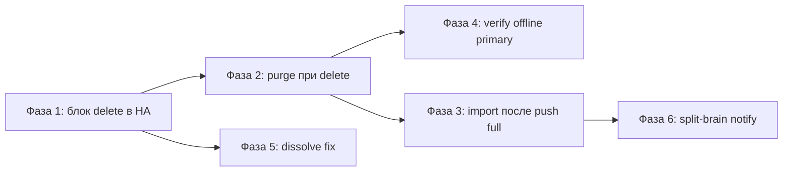

# План исправлений HA-узлов

> Основан на [HA-node-review.md](./HA-node-review.md).  
> Документ для поэтапной реализации. Код **ещё не менялся** — только план и промпты.

## Цели

| Приоритет | # | Проблема | Риск без правки |
|-----------|---|----------|-----------------|
| P0 | 1 | Удаление узла не учитывает HA-группу | 500 в Verify/reconcile, битые ссылки `primary_node_id` |
| P1 | 2 | `delete_node` не чистит связанные данные | Мусор в SQLite, `IntegrityError` на Postgres |
| P1 | 3 | `manual_full`: replica невидима после dissolve | Пустые вкладки Конфигурации/Трафик |
| P2 | 5 | Verify не обрабатывает offline primary | 500 вместо `ready: false` |
| P3 | 4 | Мёртвая ветка `stray_replica_configs` в dissolve | Неверная статистика dissolve |
| P4 | 6 | Частичный сбой auto-sync → split-brain | Документировано; опционально — уведомление |

---

## Принятые решения

| Пункт | Выбор | Обоснование |
|-------|-------|-------------|
| #1 Удаление узла в HA | **Вариант A** — запрет (`409 CONFLICT`) | Проще, предсказуемо; админ сначала расформирует группу |
| #3 Видимость replica в `manual_full` | **Вариант A** — `import_clients_from_disk` после Push full | Закрывает корень проблемы, не требует ручного Sync |
| #6 Split-brain | **Опционально** | Уже в `docs/NodeSync.md`; при желании — admin-уведомление |

Альтернативы (не выбраны, но описаны в ревью):
- #1 вариант B — авто-dissolve перед удалением
- #3 вариант B — только подсказки в UI + правка docs
- #3 вариант C — `sync_group_id` на primary без теней (дополнение к A, не замена)

---

## Затрагиваемые файлы

| Файл | Фазы |
|------|------|
| `backend/app/routers/nodes.py` | 1, 2 |
| `backend/app/services/node_manager.py` | 2 |
| `backend/app/services/config_import.py` | 3 (новый) |
| `backend/app/routers/configs.py` | 3 |
| `backend/app/services/node_sync/push_full.py` | 3 |
| `backend/app/services/node_sync/verify.py` | 4 |
| `backend/app/services/node_sync/dissolve.py` | 5 |
| `backend/app/services/node_sync/client_sync.py` | 6 (опционально) |
| `backend/tests/test_nodes_delete.py` | 1, 2 (новый) |
| `backend/tests/test_config_import.py` | 3 (новый) |
| `backend/tests/test_node_sync_push_full.py` | 3 (новый/расширить) |
| `backend/tests/test_node_sync_verify.py` | 4 (новый/расширить) |
| `backend/tests/test_node_sync_dissolve.py` | 5 (расширить) |
| `frontend/src/components/nodes/NodeSyncGroupSection.tsx` | 3 (опционально, вариант B) |
| `docs/NodeSync.md` | 3 (опционально, вариант B) |

---

## Порядок внедрения



| Фаза | Оценка | Зависимости |
|------|--------|-------------|
| 1 | ~1–2 ч | — |
| 2 | ~1 ч | — |
| 3 | ~3–4 ч | вынос сервиса + тесты push full |
| 4 | ~1 ч | — |
| 5 | ~30 мин | можно параллельно с 4 |
| 6 | ~1–2 ч | по желанию |

**MVP (защита от падений):** фазы 1 + 2 + 4 + 5.  
**Полный UX для `manual_full`:** + фаза 3.

---

## Фаза 1 — P0: защита удаления узла в HA-группе (#1)

### Симптом
`delete_node` делает `db.delete(node)` без проверки членства в `NodeSyncGroup`. Удаление primary/replica ломает группу и вызывает падения Verify/reconcile.

### Текущий код
`backend/app/routers/nodes.py`, функция `delete_node` (~строки 259–274):
```python
active_id = get_active_node_id(db)
db.delete(node)
db.commit()
```

### Изменения
1. Импорт `find_group_for_node` из `app.services.node_sync.groups`.
2. До `db.delete(node)` — проверка: `group = find_group_for_node(db, node.id)`.
3. Если группа найдена → `HTTPException(409)` с понятным текстом.

### Тесты (`backend/tests/test_nodes_delete.py`)
- Узел-primary в группе → `DELETE /api/nodes/{id}` → `409`, узел и группа на месте.
- Узел-replica в группе → `409`.
- Узел вне группы → `200`, удаление успешно.

### Критерий готовности
Удаление узла из HA-группы невозможно без предварительного dissolve. Verify/reconcile не падают с `AttributeError` на `node.is_local`.

### Промпт для выполнения

```
Реализуй фазу 1 из reviews/HA-node-fix-plan.md (проблема #1).

Задача: в backend/app/routers/nodes.py в delete_node заблокировать удаление узла,
который входит в NodeSyncGroup (вариант A — 409 CONFLICT).

Требования:
1. Используй find_group_for_node из app.services.node_sync.groups.
2. Сообщение об ошибке на русском: указать имя узла и имя группы, попросить сначала расформировать группу.
3. Добавь backend/tests/test_nodes_delete.py с тестами: primary в группе → 409, replica → 409, узел без группы → 200.
4. Запусти pytest на новые и связанные тесты.
5. Минимальный diff — не трогай несвязанный код.

Источник анализа: reviews/HA-node-review.md, раздел #1.
```

---

## Фаза 2 — P1: очистка связанных данных при удалении узла (#2)

### Симптом
Роутерный `delete_node` только делает `db.delete(node)`. Для локального узла есть `_purge_node_related`, но она приватная и не вызывается из роутера. В SQLite FK не включены → осиротевшие строки; на Postgres — `IntegrityError`.

### Эталон
`backend/app/services/node_manager.py`, `_purge_node_related` (~строки 188–198) — чистит:
`VpnConfig`, `TrafficSessionState`, `UserTrafficStatProtocol`, `WgAccessPolicy`, `OpenVpnAccessPolicy`, `NodeResourceSample`, `UserTrafficSample`.

### Изменения
1. Переименовать `_purge_node_related` → `purge_node_related` (публичная).
2. Обновить вызов в `_remove_local_node`.
3. В `delete_node` вызвать `purge_node_related(db, node.id)` перед `db.delete(node)`.

### Тесты
- Создать удалённый узел + `VpnConfig` + `UserTrafficStatProtocol` → удалить → записей с этим `node_id` нет.
- Убедиться, что фаза 1 (блок HA) по-прежнему работает.

### Вне скоупа
`PRAGMA foreign_keys=ON` в SQLite — отдельная задача (нужен аудит всех FK/cascade).

### Критерий готовности
Удаление удалённого узла не оставляет осиротевших строк. На Postgres нет `IntegrityError`.

### Промпт для выполнения

```
Реализуй фазу 2 из reviews/HA-node-fix-plan.md (проблема #2).

Задача: при удалении удалённого узла очищать связанные данные так же, как для локального.

Требования:
1. В backend/app/services/node_manager.py переименуй _purge_node_related в purge_node_related.
2. Обнови все внутренние вызовы (_remove_local_node и др.).
3. В backend/app/routers/nodes.py в delete_node вызови purge_node_related(db, node.id) перед db.delete(node).
4. Добавь/расширь тесты в backend/tests/test_nodes_delete.py: после удаления нет VpnConfig и UserTrafficStatProtocol с node_id удалённого узла.
5. Запусти pytest.
6. Не включай PRAGMA foreign_keys — это вне скоупа.

Источник: reviews/HA-node-review.md, раздел #2.
```

---

## Фаза 3 — P1: импорт клиентов replica после Push full (#3, вариант A)

### Симптом
В режиме `manual_full` Push full копирует файлы на replica, но не создаёт `VpnConfig`. После dissolve вкладка Конфигурации на replica пуста, хотя клиенты есть на диске.

### Изменения

**1. Новый сервис** `backend/app/services/config_import.py`:
```python
def import_clients_from_disk(db: Session, node: Node, owner_id: int) -> int:
    """Импорт клиентов OpenVPN/WireGuard с диска узла в VpnConfig."""
    ...
```

Логику вынести из `backend/app/routers/configs.py::sync_from_antizapret` (~строки 604–661):
- `adapter.list_openvpn_clients()` / `list_wireguard_clients()`
- проверка существования по `(node_id, client_name, vpn_type)`
- `resolve_openvpn_cert_days_remaining` для OpenVPN
- `owner_id` — переданный параметр

**2. Рефакторинг роутера** `configs.py`:
`sync_from_antizapret` вызывает `import_clients_from_disk` — поведение API не меняется.

**3. Push full** `backend/app/services/node_sync/push_full.py`:
После успешного `restore_antizapret_backup` на каждой replica — вызов `import_clients_from_disk`.
`owner_id` — первый admin (как в `/configs/sync`).

### Поток
```
Push full → backup primary → restore replica[i]
         → import_clients_from_disk(replica[i])   ← новое
         → verify (если auto_verify)
```

### Тесты
- Mock-адаптер: клиенты на диске, в БД пусто → после push full есть `VpnConfig` на replica.
- Dissolve после push full → список конфигов replica не пустой.
- Повторный push full не дублирует записи (идемпотентность).
- `sync_from_antizapret` по-прежнему работает через общий сервис.

### Связанные задачи (вне скоупа фазы 3)
- Политики на replica не копируются — отдельный epic.
- Двойной счёт квоты user после dissolve в `auto` — `self_service.py`, отдельная задача.
- HA-бейдж в `manual_full` — только в `auto` (см. ревью #3 вариант C).

### Критерий готовности
После Push full в `manual_full` клиенты replica видны в панели без ручного «Конфигурации → Синхронизировать».

### Промпт для выполнения

```
Реализуй фазу 3 из reviews/HA-node-fix-plan.md (проблема #3, вариант A).

Задача: после успешного restore на replica в run_push_full автоматически импортировать клиентов в VpnConfig.

Шаги:
1. Создай backend/app/services/config_import.py с функцией import_clients_from_disk(db, node, owner_id) -> int.
   Вынеси логику из backend/app/routers/configs.py::sync_from_antizapret (строки ~604–661).
2. Рефакторни sync_from_antizapret — тонкая обёртка над import_clients_from_disk.
3. В backend/app/services/node_sync/push_full.py после успешного restore каждой replica вызови import_clients_from_disk.
   owner_id — первый admin User с role=admin (как в sync_from_antizapret).
4. Тесты:
   - backend/tests/test_config_import.py — unit-тесты сервиса
   - backend/tests/test_node_sync_push_full.py — push full создаёт VpnConfig на replica
   - идемпотентность повторного импорта
5. Запусти pytest backend/tests/test_config_import.py backend/tests/test_node_sync_push_full.py и связанные.
6. Минимальный diff, следуй стилю существующего кода.

Источник: reviews/HA-node-review.md, разделы #3 и #7.
```

### Промпт (опционально, вариант B — только UX)

```
Дополни фазу 3 вариантом B (если вариант A уже сделан или вместо него).

Задача: честный UX без автоматического импорта.

1. В frontend/src/components/nodes/NodeSyncGroupSection.tsx для sync_mode=manual_full показать подсказку:
   «После расформирования группы на replica выполните Конфигурации → Синхронизировать».
2. В docs/NodeSync.md уточни: HA-бейдж и авто-видимость клиентов на replica — только в режиме auto.

Не меняй backend, если вариант A не реализован.
```

---

## Фаза 4 — P2: graceful offline primary в Verify (#5)

### Симптом
`verify_sync_group` сразу вызывает `primary_adapter.list_openvpn_clients()` без проверки статуса primary. Для replica есть проверка `node.status == online`, для primary — нет → 500 при offline primary.

### Текущий код
`backend/app/services/node_sync/verify.py`, ~строки 35–38:
```python
progress(5, "Проверка паритета…", "Primary")
primary_adapter = get_adapter_for_node(db.get(Node, group.primary_node_id))
primary_ovpn = set(primary_adapter.list_openvpn_clients())
```

### Изменения
До сетевых вызовов:
```python
primary_node = db.get(Node, group.primary_node_id)
if not primary_node or primary_node.status != NodeStatus.online:
    result = {
        "ready": False,
        "shared_domain": group.shared_domain,
        "primary_node_id": group.primary_node_id,
        "replicas": [],
        "summary": "primary offline или не найден",
    }
    group.last_verify_at = datetime.utcnow()
    group.last_verify_result = json.dumps(result, ensure_ascii=False)
    db.commit()
    return result
```

### Тесты
- Primary offline → `ready=False`, без исключения, `last_verify_result` сохранён.
- Primary online → поведение как раньше.

### Критерий готовности
`GET /nodes/sync-groups/{id}/verify` и reconcile не дают 500 при offline primary.

### Промпт для выполнения

```
Реализуй фазу 4 из reviews/HA-node-fix-plan.md (проблема #5).

Задача: в verify_sync_group обработать offline/отсутствующий primary так же gracefully, как offline replica.

Требования:
1. Файл: backend/app/services/node_sync/verify.py.
2. До get_adapter_for_node(primary) проверь: primary_node существует и status == NodeStatus.online.
3. Если нет — верни ready=False, summary="primary offline или не найден", сохрани в last_verify_at/last_verify_result, commit, return.
4. Не бросай исключение наружу.
5. Тесты в backend/tests/test_node_sync_verify.py (создай если нет).
6. Запусти pytest.

Источник: reviews/HA-node-review.md, раздел #5.
```

---

## Фаза 5 — P3: исправление dissolve.py (#4)

### Симптом
Первый запрос `primary_configs` берёт все конфиги группы с `ha_primary_config_id IS NULL` без фильтра по `node_id`. Он сбрасывает `sync_group_id` у всех, включая replica → ветка `stray_replica_configs` всегда пуста. Счётчик `primary_configs_detached` завышен.

### Текущий код
`backend/app/services/node_sync/dissolve.py`, ~строки 17–24.

### Изменение
Добавить фильтр `VpnConfig.node_id == group.primary_node_id` в первый запрос:
```python
primary_configs = (
    db.query(VpnConfig)
    .filter(
        VpnConfig.sync_group_id == group.id,
        VpnConfig.ha_primary_config_id.is_(None),
        VpnConfig.node_id == group.primary_node_id,  # ← добавить
    )
    .all()
)
```

### Тесты (расширить `test_node_sync_dissolve.py`)
- Primary config + shadow + stray replica config (без `ha_primary_config_id`, `node_id != primary`) → все отвязываются.
- Счётчики `primary_configs_detached` и `replica_configs_detached` точные.
- Существующие тесты dissolve не сломаны.

### Критерий готовности
`stray_replica_configs` реально обрабатывает осиротевшие replica-конфиги; статистика dissolve корректна.

### Промпт для выполнения

```
Реализуй фазу 5 из reviews/HA-node-fix-plan.md (проблема #4).

Задача: исправить мёртвую ветку stray_replica_configs в dissolve_sync_group.

Требования:
1. В backend/app/services/node_sync/dissolve.py добавь фильтр VpnConfig.node_id == group.primary_node_id в запрос primary_configs.
2. Расширь backend/tests/test_node_sync_dissolve.py:
   - кейс со stray replica config (sync_group_id=group.id, ha_primary_config_id=NULL, node_id=replica)
   - проверь счётчики primary_configs_detached и replica_configs_detached
3. Убедись, что существующие тесты dissolve проходят.
4. Запусти pytest backend/tests/test_node_sync_dissolve.py.

Источник: reviews/HA-node-review.md, раздел #4.
```

---

## Фаза 6 — P4 (опционально): уведомление при split-brain (#6)

### Симптом
В `replicate_client_create` при ошибке на части реплик primary_config получает `sync_group_id`, `sync_status=failed`. Клиент создан на primary и части реплик. Восстановление — повторный Push full. Уже документировано в `docs/NodeSync.md`.

### Изменения (по желанию)
В `backend/app/services/node_sync/client_sync.py` при частичном сбое:
- запись в action log (`log_action`), или
- admin-уведомление через существующий механизм уведомлений.

### Критерий готовности
Админ видит явное предупреждение о частичном сбое репликации, не только `sync_status=failed` в UI группы.

### Промпт для выполнения

```
Реализуй фазу 6 из reviews/HA-node-fix-plan.md (проблема #6, опционально).

Задача: при частичном сбое replicate_client_create уведомить админа.

Требования:
1. Файл: backend/app/services/node_sync/client_sync.py.
2. Когда клиент создан на primary, но не на всех репликах — log_action с action вроде "ha_replicate_partial_failure", details: имя клиента, успешные/неуспешные replica.
3. Не меняй логику репликации — только observability.
4. Тест: mock частичный сбой → action log содержит запись.
5. Запусти pytest.

Источник: reviews/HA-node-review.md, раздел #6.
```

---

## Промпт: MVP целиком (фазы 1+2+4+5)

```
Реализуй MVP из reviews/HA-node-fix-plan.md — фазы 1, 2, 4 и 5 (без фазы 3 и 6).

Порядок:
1. Фаза 1: блок delete_node для узлов в HA-группе (409).
2. Фаза 2: purge_node_related при удалении удалённого узла.
3. Фаза 4: graceful offline primary в verify_sync_group.
4. Фаза 5: фильтр node_id в dissolve primary_configs.

После каждой фазы — pytest. В конце — полный прогон:
pytest backend/tests/test_nodes_delete.py backend/tests/test_node_sync_dissolve.py backend/tests/test_node_sync_verify.py

Следуй деталям и критериям готовности в reviews/HA-node-fix-plan.md.
Не трогай push_full и config_import — это фаза 3.
```

---

## Промпт: полная реализация (все фазы)

```
Реализуй все фазы из reviews/HA-node-fix-plan.md в рекомендованном порядке: 1 → 2 → 4 → 5 → 3 → (6 по желанию).

Используй принятые решения:
- #1 вариант A (запрет удаления узла в HA)
- #3 вариант A (import_clients_from_disk после Push full)

После каждой фазы запускай соответствующие pytest. В конце:
pytest backend/tests/test_nodes_delete.py backend/tests/test_config_import.py backend/tests/test_node_sync_push_full.py backend/tests/test_node_sync_verify.py backend/tests/test_node_sync_dissolve.py

Минимальные диффы, стиль существующего кода. Источник анализа: reviews/HA-node-review.md.
```

---

## Чеклист перед merge

- [ ] `pytest backend/tests/test_node_sync_*.py backend/tests/test_nodes_delete.py` — зелёные
- [ ] Удаление узла в HA-группе → `409 CONFLICT`
- [ ] Удаление узла вне группы → связанные данные очищены
- [ ] Push full `manual_full` → клиенты видны на replica без ручного Sync (фаза 3)
- [ ] Verify при offline primary → `ready: false`, не 500
- [ ] Dissolve: счётчики и stray replica configs корректны
- [ ] Существующие тесты `test_node_sync_dissolve.py`, `test_node_sync_groups.py` не сломаны

---

## Поведение вкладок после dissolve (справка)

См. [HA-node-review.md](./HA-node-review.md), раздел #7.

| Вкладка | После dissolve (`auto`) | После dissolve (`manual_full`) |
|---------|-------------------------|--------------------------------|
| Конфигурации | OK, свои клиенты на каждой ноде | Replica пусто без Sync → **фаза 3 закрывает** |
| Трафик | OK на каждой ноде | Replica пусто без записей в БД → **фаза 3 частично** |
| Политики | Свои на каждой ноде | На replica часто пусто — **вне скоупа** |
| Квота user | Возможен двойной счёт | То же — **вне скоупа** |

---

## Связанные документы

- [HA-node-review.md](./HA-node-review.md) — исходный анализ проблем
- `docs/NodeSync.md` — документация режимов `manual_full` / `auto`
