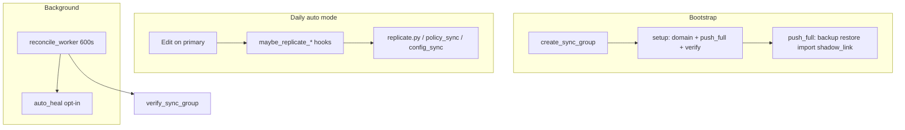

# План устранения проблем HA-синхронизации

Аудит Node Sync (HA): узкие места, риски split-brain и поэтапный план исправлений.  
**Статус:** фазы 1–3 реализованы в коде (см. чеклист в конце).

---

## Краткая архитектура

**Два режима:** `manual_full` (crypto on create/delete, без shadow/policies/files auto) vs `auto` (event-driven replicate + shadow `ha_primary_config_id`).

---

## 1. Критические проблемы (P0) — исправлено

### 1.1 Счётчик auto-heal

**Было:** `prior_failures` читался из свежего `verify_sync_group()`, счётчик не накапливался.  
**Стало:** чтение из `group.last_verify_result` до verify; сохранение `auto_heal_failures` при persist; тест на 3 failed heal → notify.

**Файлы:** `backend/app/services/node_sync/reconcile_worker.py`, `backend/tests/test_node_sync_reconcile_worker.py`

### 1.2 Reconcile vs pending

**Было:** reconcile мог выставить `failed` во время Push full / Setup.  
**Стало:** `if group.sync_status == SyncStatus.pending: continue`.

### 1.3 Push full continue-on-error

**Было:** первая упавшая реплика прерывала цикл.  
**Стало:** try/except per replica, shadow link только если все restore OK, итоговый `sync_status=failed` при partial failure.

### 1.4 Replica write guards

**Было:** edit_files, routing, settings без `require_ha_primary_*`.  
**Стало:** backend 403 + frontend `HaReplicaBanner` / readonly на Edit Files, Routing, Settings (списки).

---

## 2. Логические несоответствия (P1) — исправлено

| # | Проблема | Решение |
|---|----------|---------|
| 2.1 | Renew без shadow — hard error | Crypto PKI fallback в `_handle_client_renew_cert` |
| 2.3 | auto→manual оставляет shadow | `clear_shadow_links_for_group` при смене режима |
| 2.4 | Смена membership без push full | UI prompt «Обязательна полная синхронизация» |
| 2.5 | Verify затирает `failed` | Verify обновляет только `last_verify_*` |
| 2.6 | synced + last_sync_error | Push full → failed при shadow/verify issues |
| 2.7 | NODE_SYNC_AUTO_REPLICATE_POLICIES | Проверка флага в `policy_sync.py` |
| 2.8 | Docs: domain на create | NodeSync.md: domain через Setup / apply-shared-domain |

---

## 3. UX (P2) — исправлено

- Два badge: Verify + Replication в таблице групп
- `warnings` в `group_to_dict` / API
- Resume pending task после reload (`last_sync_task_id`)
- Кнопки: Настройка / Push full / Домен
- Mode-aware verify hints (`haVerifySummary.ts`)
- Runbook-ссылка в секции HA
- HA banner на Edit Files / Routing

---

## 4. Операционные сценарии

### A. Конфиги до панели → HA auto без Push full

Orphan/shadow gaps. **Mitigation:** shadow_link при bootstrap + предупреждение в UI + Push full.

### B. manual_full create client

Crypto OK, нет строки на реплике в панели. **Mitigation:** hint «нужен Push full для панели».

### C. Dissolve группы

Replica DB stale. **Mitigation:** runbook + «Синхронизировать» на реплике после расформирования.

### D–H. Backlog (фаза 4)

WG runtime silent fail, full OVPN PKI на каждый delete, CSV partial fail, provider toggle без HA, offline replica — см. фазу 4 ниже.

---

## 5. Фазы внедрения

### Фаза 0 — Документ-аудит ✅

Этот файл.

### Фаза 1 — P0 ✅

1. Auto-heal counter + test  
2. Skip pending in reconcile  
3. Push full continue-on-error  
4. Backend replica guards  
5. Frontend replica readonly  

### Фаза 2 — P1 ✅

1. Renew shadow fallback  
2. Mode transition cleanup  
3. Membership → push-full prompt  
4. Split verify vs replicate status  
5. Push full failed on shadow/verify  
6. NODE_SYNC_AUTO_REPLICATE_POLICIES wired  
7. NodeSync.md fixes  

### Фаза 3 — UX ✅

Dual badges, warnings API, task resume, split sync actions, mode-aware hints, HA banners, runbook link.

### Фаза 4 — Hardening (backlog)

1. Reconcile + verify policy parity  
2. Incremental OVPN PKI sync  
3. Consolidate replicate registry  
4. Integration tests (dissolve, router 409)  
5. Provider toggle HA replicate  

---

## 6. Матрица «проблема → файлы»

| ID | Проблема | Backend | Frontend | Docs |
|----|----------|---------|----------|------|
| P0-1 | auto-heal counter | reconcile_worker.py | — | NodeSync.md |
| P0-2 | pending race | reconcile_worker.py | NodeSyncGroupSection | — |
| P0-3 | push full abort | push_full.py | NodeSyncGroupSection | NodeSync.md |
| P0-4 | replica edits | edit_files, routing, settings | EditFilesPage, RoutingPage | edit-files.md |
| P1-5 | renew no fallback | replicate.py | — | NodeSync.md |
| P1-6 | mode switch | node_sync.py, dissolve.py | NodeSyncGroupSection | NodeSync.md |
| P1-7 | verify/sync status | verify.py, push_full.py | readinessBadge | — |
| P2-8 | warnings API | groups.py | NodeSyncGroupSection | — |
| P2-9 | task resume | node_sync.py | useBackgroundTaskPoll | — |

---

## 7. Чеклист проверки

**Код реализован**

- [x] 3 failed auto-heal → admin notify
- [x] Push full: partial failure не прерывает остальные реплики
- [x] Reconcile during pending → skip
- [x] Save edit-files on replica → 403 (backend guard)
- [x] auto→manual: clear `ha_primary_config_id`
- [ ] Delete client after bootstrap shadow → removed on all replicas (existing behavior)
- [x] UI: failed replication visible when verify ready (dual badges)
- [ ] Dissolve group → shadow links cleared (existing behavior, add test later)
- [x] Membership + domain change → push-full prompt (не только domain apply)
- [x] `NODE_SYNC_AUTO_REPLICATE_POLICIES` в `replicate_node_default_policy` / `heal_policy_drift`
- [x] AntizapretConfigTab: HA replica readonly (banner + disabled save/apply)

**Автотесты**

- [x] 3 failed auto-heal → admin notify (`test_node_sync_reconcile_worker.py`)
- [x] Push full continue-on-error multi-replica (`test_node_sync_push_full.py`)
- [x] Reconcile during pending → skip (`test_node_sync_reconcile_worker.py`)
- [x] Save edit-files on replica → 403 (`test_edit_files_ha_replica.py`)
- [ ] Delete client after bootstrap shadow (integration, backlog)
- [ ] Dissolve group → shadow links cleared (backlog)

---

## 8. Ссылки на код

- Reconcile: `backend/app/services/node_sync/reconcile_worker.py`
- Push full: `backend/app/services/node_sync/push_full.py`
- Verify: `backend/app/services/node_sync/verify.py`
- Groups / guards: `backend/app/services/node_sync/groups.py`
- API: `backend/app/routers/node_sync.py`
- UI: `frontend/src/components/nodes/NodeSyncGroupSection.tsx`
- Документация: `docs/NodeSync.md`
